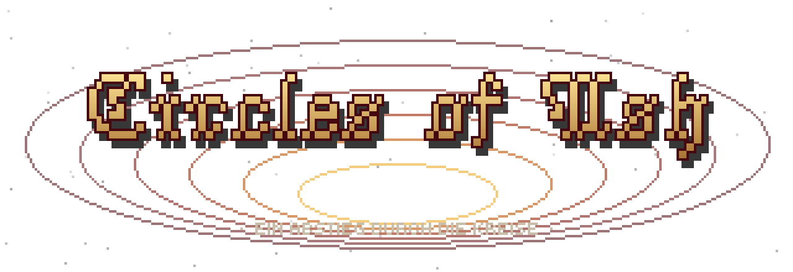
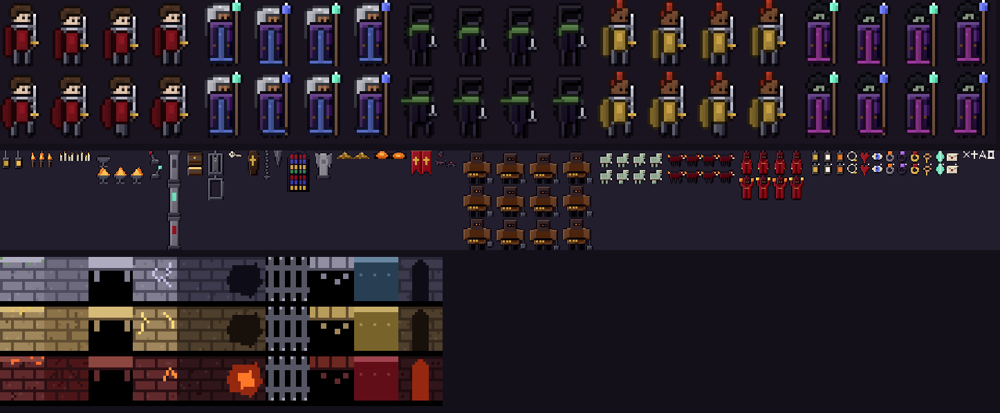
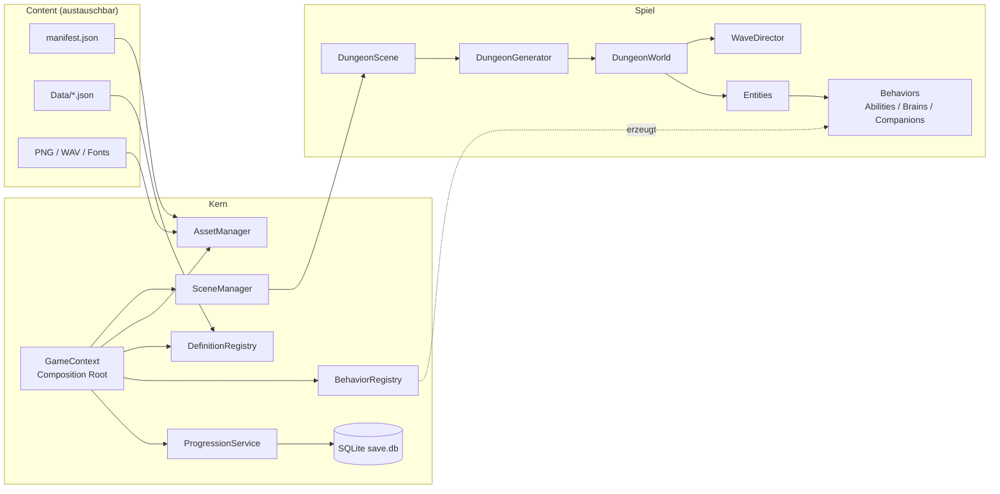
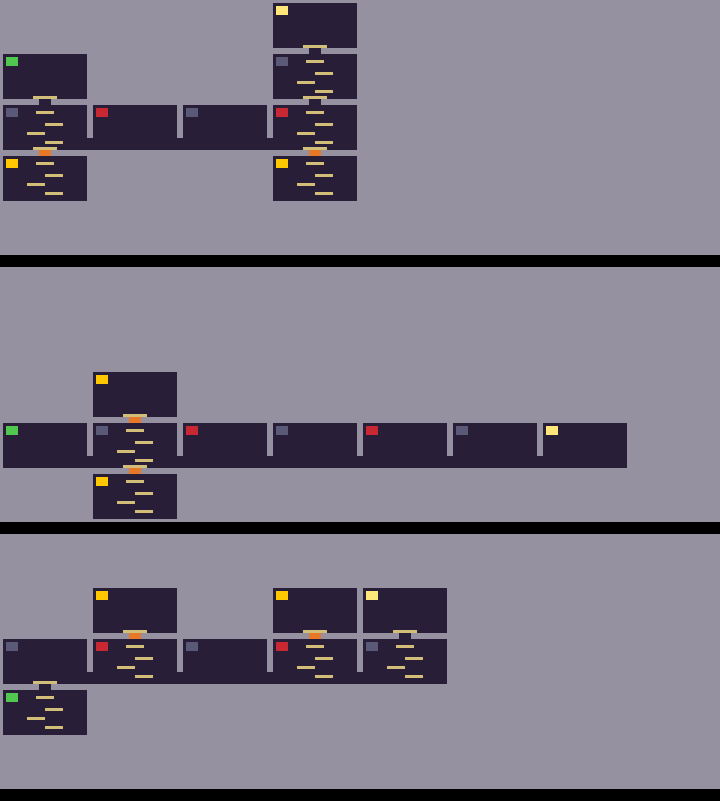

<p align="center"></p>

# Circles of Ash

> Ein gefallener Gott steigt durch die Kreise der Hölle hinab, um die Verdammten zu befreien –
> und wird mit jedem Gläubigen mächtiger.

**Circles of Ash** ist ein gotischer Pixel-Art-**Side-Scroller** in C#/MonoGame, der drei Genres verbindet:

| Genre | Umsetzung im Spiel |
|---|---|
| **Vampire Survivors** | Fähigkeiten feuern automatisch, Gegner kommen in Wellen, Level-Up = 1 aus 3 Upgrades |
| **Roguelike** | Prozedurale Dungeons, Permadeath: Tod setzt den Lauf **und die Klasse** zurück |
| **Metroidvania** | Dungeons sind Raumnetze mit vertikalen Schächten, Minikarte und Sperren (rissige Wände), die erst mit Boss-Fähigkeiten passierbar sind |



---

## Inhalt

1. [Spielkonzept](#spielkonzept)
2. [Schnellstart](#schnellstart)
3. [Steuerung](#steuerung)
4. [Der Tempel (Hub)](#der-tempel-hub)
5. [Optionen & Schwierigkeit](#optionen--schwierigkeit)
6. [Projektstruktur](#projektstruktur)
7. [Architektur](#architektur)
8. [Technische Entscheidungen](#technische-entscheidungen)
9. [Erweitern – Schritt für Schritt](#erweitern--schritt-für-schritt)
10. [Assets austauschen & Mods](#assets-austauschen--mods)
11. [Spielstand (SQLite)](#spielstand-sqlite)
12. [Auslieferung & Release](#auslieferung--release)
13. [Roadmap](#roadmap)
14. [Lizenz](#lizenz)

---

## Spielkonzept

```
Welt (z. B. "Das Inferno")
 └─ Kreis 1 … n          ← Schichten nach Dantes Inferno (Limbus, Gier, Zorn …)
     └─ Verlies 1 – 4    ← Wellen-Dungeons, werden pro Stufe schwerer
     └─ Verlies 5        ← Thronsaal: reiner Bosskampf, keine Wellen
```

- **Verliese** werden prozedural erzeugt. In Arena-Räumen versiegeln sich die Türen und Wellen spawnen.
  Sind alle Arenen geläutert, erwacht das **Siegel** – wer es erreicht, schließt das Verlies ab.
- **Bosse** kämpfen in Phasen (datengetrieben). Ein Sieg schaltet eine **Ewige Gabe** frei, die
  **dauerhaft** erhalten bleibt – auch nach dem Tod (z. B. Dash, Doppelsprung, Jüngstes Gericht).
- **Gläubige** erhältst du durch befreite Verliese, Kreise und Welten. Sie machen dich als Gott stärker
  (+Schaden, +Leben) und wecken neue **Begleitseelen**. Beim Tod bleibt nur ein Teil treu (Standard 25 %).
- **Klassen**: Kreuzritter (Nahkampf), Magier (Fernkampf/Mana), Schatten (Tarnung + Bonusschaden).
  Beim Tod ist die Klasse vergessen – du wählst neu.
- **Begleitseelen**: Angreifer, Heiler oder Manaspender, die dir folgen.
- **Metroidvania-Sperren**: Schatzräume liegen hinter rissigen Wänden. Erst mit dem *Abgrundschritt*
  (Belohnung des ersten Bosses) kommst du hinein – in allen künftigen Läufen.

### Neu in Version 2

| Feature | Was passiert im Spiel | Wo im Code / in den Daten |
|---|---|---|
| **Charakter-Editor** | Name, Klasse, Hautton, Frisur, Haar- und Wappenfarbe; F5 würfelt. Die alten Charaktere sind jetzt **Klassen** | `Scenes/CharacterCreatorScene.cs`, `Assets/LayeredSprite.cs`, `Data/appearance.json` |
| **Abstieg spürbar** | Jeder Kreis hat eigenes Tileset, dunkleres Umgebungslicht, mehr Verfall (zerbrochene Wände, **bröckelnde Plattformen**) und eigene Partikel (Staub → Asche → Glut) | `World/LightingSystem.cs`, `World/CrumbleSystem.cs`, `worlds.json` (`ambientLight`, `decay`) |
| **Licht & Laternen** | 2D-Licht ohne Shader: Fackeln, Laternen, Fenster, Glutspalten. Getragene **Laternen** vergrößern dein Licht | `LightingSystem`, `items.json` (`LightRadius`) |
| **Items & Truhen** | Laternen, Amulette, Ringe mit Boni. Truhen mit Beute, Schatzkammern mit besserer Beute. Inventar im Pause- und Kreis-Menü | `Progression/EquipmentService.cs`, `Scenes/InventoryScene.cs` |
| **Bitten der Gläubigen** | Missionen annehmen (sammeln, töten, befreien, Kreis abschließen) → Gläubige als Lohn. Fortschritt bleibt nach dem Tod | `Progression/MissionService.cs`, `Scenes/MissionBoardScene.cs`, `missions.json` |
| **Räume mit Persönlichkeit** | Krypta, Tropfsteinhöhle (zerklüftet, **Fledermäuse flattern davon**), Kathedrale, überfluteter Kreuzgang (**Teich** zum Schwimmen), Schatzgewölbe, Glutschmiede … | `themes.json`, `props.json`, `Props/PropBehaviors.cs` |
| **Mehrere Wege** | Der Generator baut Parallelrouten (Umwege) neben dem Hauptpfad | `DungeonGenerator.AddDetours` |
| **Rätsel & Siegeltor** | Das Siegel steht hinter einem Gittertor. Öffnen durch: verteilte **Hebel**, **Runenfolge** (Hinweis-Inschrift in einem anderen Raum) oder **Feuerbecken** auf Zeit | `Puzzles/Puzzles.cs`, `worlds.json` (`puzzles`) |
| **Kerker & Mini-Boss** | Ein Verlies pro Kreis hat einen optionalen Kerker. Besiege den Kerkermeister → Gefangene frei → **neue Begleitseele** | `WaveDirector`, `worlds.json` (`prison`), `companions.json` (`unlockAtBelievers: -1`) |
| **Logo & Ladebildschirm** | Animierter Höllentrichter, Asche, Tipps, echter Fortschritt (Assets werden vorgeladen) | `Scenes/LoadingScene.cs`, `UI/InfernoFunnel.cs`, `tips.json` |

---

## Schnellstart

**Voraussetzung:** [.NET 8 SDK](https://dotnet.microsoft.com/download) (oder neuer). Mehr nicht –
MonoGame und SQLite kommen automatisch über NuGet.

```bash
git clone https://github.com/LevinTheDoctor/CiclesOfAsh.git
cd CiclesOfAsh
dotnet run --project src/CirclesOfAsh
```

### Windows-Build (eigenständig, ohne installiertes .NET beim Spieler)

```powershell
.\build\publish-windows.ps1
# -> publish\win-x64\CirclesOfAsh.exe
```

### Andere Betriebssysteme

Das Projekt nutzt **MonoGame DesktopGL** (OpenGL + SDL2) und ist damit ohne Codeänderung
plattformübergreifend. Nur der Runtime Identifier ändert sich:

```bash
./build/publish.sh linux-x64
./build/publish.sh osx-arm64
```

Für macOS gibt es ein fertiges Programmbündel statt einer nackten Binärdatei:

```bash
./build/macos-app.sh osx-arm64     # Apple Silicon
./build/macos-app.sh osx-x64       # Intel
# -> publish/osx-arm64/CirclesOfAsh.app
```

Mehr dazu unter [Auslieferung & Release](#auslieferung--release).

---

## Steuerung

| Aktion | Tastatur | Gamepad |
|---|---|---|
| Bewegen | A / D oder ← / → | Linker Stick / D-Pad |
| Springen (halten = höher) | Leertaste / K | A |
| Durch Plattform fallen | S + Springen | Runter + A |
| Dash *(Ewige Gabe)* – mit W/S vertikal | Shift / L | RB / B |
| Fähigkeit 1 (z. B. Schleier) | Q / J | X |
| Fähigkeit 2 (z. B. Jüngstes Gericht) | E / I | Y |
| Benutzen (Hebel, Truhe, Rune, Feuer) | F / W | LB / D-Pad hoch |
| Schwimmen (im Wasser) | Springen mehrfach | A mehrfach |
| Menü bestätigen | Enter | A / Start |
| Zufällige Gestalt (Editor) | F5 | Back |
| Pause / Zurück | Esc | Start / B |

Angriffe laufen automatisch. Tastenbelegung: `Core/InputState.cs`.

### Controller-Profile

Das Spiel erkennt am Gerätenamen, welcher Controller angeschlossen ist, und beschriftet alle
Hinweise im Spiel entsprechend – Xbox zeigt `A`, PlayStation `X`/`○`/`□`/`△`, Switch die
vertauschte Belegung `B`/`A`/`Y`/`X`, Steam Deck wie Xbox. Ohne Controller stehen dort die Tasten.

Die Profile sind reine Daten: `Content/Data/controllers.json`. Ein neuer Controller braucht dort
nur einen Eintrag mit `match` (Textbausteine im Gerätenamen) und `labels` – kein Codeeingriff.
Das Auffangprofil ist das mit leerem `match`; genau eines davon muss es geben.

Vibration hängt an `DungeonWorld.ShakeCamera`: Jeder wuchtige Moment erschüttert ohnehin schon die
Kamera, also vibriert der Controller im selben Maß. Stärke = Regler im Optionsmenü × Schwierigkeitsstufe.

---

## Der Tempel (Hub)

Zwischen zwei Abstiegen steht man nicht in einem Menü, sondern im **begehbaren Tempel der Gläubigen**.
Man läuft hin und benutzt, was man braucht:

| Ort | Was dort passiert |
|---|---|
| **Höllentor** (rechts, glühender Schlund) | Öffnet die Kreis-Übersicht – von dort geht es hinab |
| **Truhe** (links) | Ausrüstung des laufenden Abstiegs |
| **Missionsbrett** (linkes Podest) | Bitten der Gläubigen annehmen und aufgeben |
| **Schrein** (rechtes Podest) | Gesammelte Reliquien über alle Läufe |
| **Tempelwärtin** (Mitte) | Dialog: Hinweise, Erklärungen zu den Haustieren |
| **Begleitseelen** (laufen frei herum) | Streicheln und füttern – hebt Stimmung und Loyalität |
| **Deko-Modus** (F5) | Deko frei platzieren, kostet Gläubige, bleibt gespeichert |

Der Tempel ist in `Scenes/HubScene.cs`; sein Grundriss entsteht in `BuildHubMap()`. Die festen
Standorte stehen als Properties (`GateSpot`, `ChestSpot`, `BoardSpot`, `ShrineSpot`) an einer Stelle,
damit Erkennung und Darstellung nicht auseinanderlaufen.

---

## Optionen & Schwierigkeit

Das Optionsmenü (`Esc` → Optionen, `Scenes/SettingsScene.cs`) wirkt sofort und wird in SQLite gesichert:

* **Bildschirm** – Größe (1×–6× der virtuellen 480×270), Vollbild, VSync
* **Audio** – Master, Musik und Effekte getrennt regelbar
* **Gameplay** – Helligkeit (gegen zu dunkle Verliese), Vibration, Schadenszahlen, Schwierigkeit

### Schwierigkeitsstufen

Vier Stufen in `Content/Data/difficulties.json`: **Büßer**, **Gläubiger** (Standard), **Märtyrer**,
**Verdammter**. Alle Werte sind Multiplikatoren und greifen an je einer Stelle im Code:

| Feld | Wirkung |
|---|---|
| `enemyHealth`, `enemyDamage`, `enemySpeed` | Gegnerwerte beim Spawn (`DungeonWorld.SpawnEnemy`) |
| `waveSize` | Wellengröße (`WaveDirector`) |
| `healMultiplier` | Wie viel ein Herz heilt |
| `xpMultiplier` | Seelen-Ertrag (`DungeonWorld.GainExperience`) |
| `rewardMultiplier` | Gläubige pro geschafftem Verlies |
| `believerRetention` | Anteil der Gläubigen, der den Tod überdauert |
| `rumbleMultiplier` | Vibrationsstärke |

Eine eigene Stufe ist ein weiterer Eintrag in der JSON – kein Codeeingriff. Die Stufe `devout` muss
existieren, sie ist der Rückfallwert.

---

## Projektstruktur

```
CirclesOfAsh/
├─ src/CirclesOfAsh/
│  ├─ Content/                  ← ALLE austauschbaren Inhalte (wird neben die .exe kopiert)
│  │  ├─ manifest.json          ← Asset-IDs → Dateien, Spritesheet-Raster, Animationen
│  │  ├─ Data/*.json            ← Klassen, Fähigkeiten, Gegner, Welten, Upgrades, Balancing
│  │  ├─ Textures/ Fonts/ Audio/
│  ├─ Core/          Game-Loop-Infrastruktur: Szenen, Eingabe, Kamera, ContentLocator, Log
│  ├─ Assets/        Laufzeit-Laden von PNG/WAV/Fonts, Spritesheets, Animationen
│  ├─ Definitions/   Datenklassen (1:1 JSON) + Laden/Validieren
│  ├─ Modding/       BehaviorRegistry: JSON-Schlüssel → C#-Klassen
│  ├─ World/         Kachelkarte, Physik, Generator, Wellen, Licht, Bröckeln, Laufzeitwelt
│  ├─ Entities/      Spieler, Gegner, Projektile, Pickups, Props, Begleiter, Effekte
│  ├─ Props/         Verhalten der Weltobjekte (Fledermäuse, Hebel, Truhen, Käfige …)
│  ├─ Puzzles/       Rätsel vor dem Siegeltor (Hebel, Runenfolge, Feuerbecken)
│  ├─ Abilities/     Fähigkeits-Verhalten (Projektil, Nova, Orbit, Dash …)
│  ├─ Enemies/       Gegner-KI (Brains) und Boss-Angriffe
│  ├─ Companions/    Begleiter-Verhalten
│  ├─ Dialogs/       DialogService: Bedingungen, Antworten, Wirkungen (Segen, Bitten, Füttern)
│  ├─ Pets/          PetService: Name, Stimmung, Loyalität der Begleitseelen
│  ├─ Progression/   Lauf/Meta-Zustand, Regeln, Level-Up, Spieler-Factory, Items, Missionen, Einstellungen
│  ├─ Persistence/   ISaveRepository + SQLite-Implementierung mit Migrationen
│  ├─ Scenes/        Laden, Titel, Charakter-Editor, Tempel, Kreis-Übersicht, Dungeon, Dialog, Optionen, Overlays
│  └─ UI/            HUD, Minikarte, Menüs, Panels
├─ tools/generate_placeholder_assets.py   ← erzeugt alle Platzhalter-Assets (CC0)
├─ tools/assetgen/                         ← Generator-Module: Charaktere, Kreaturen, Welt, Medien, Musik, Icons
├─ build/publish.sh, macos-app.sh          ← Publish-Skripte, macOS-Programmbündel
├─ build/icons/                            ← erzeugte App-Icons (.icns/.ico)
└─ .github/workflows/                      ← CI (build.yml) und Release für alle Systeme (release.yml)
```

---

## Architektur



### Verwendete Muster (kurz erklärt)

| Muster | Wo | Wozu |
|---|---|---|
| **Data-Driven Design** | `Content/Data/*.json` | Inhalte ohne Neukompilieren ändern/ergänzen |
| **Strategy** | `IAbilityBehavior`, `IEnemyBrain`, `IBossAttack`, `ICompanionBehavior` | Verhalten austauschbar, jede Variante eine Klasse |
| **Factory + Registry** | `BehaviorRegistry`, `PlayerFactory` | JSON-Schlüssel → neue Instanz; Aufbau komplexer Objekte an einer Stelle |
| **State (Scene Stack)** | `SceneManager`, `IScene` | Bildschirme als Zustände, Overlays pausieren darunterliegende Szenen |
| **Observer** | `DungeonWorld.PlayerDied / GoalReached` | Welt meldet Ereignisse, ohne Szenen zu kennen |
| **Repository** | `ISaveRepository` | Spiellogik unabhängig vom Speicherformat |
| **Composition Root** | `GameContext.Create` | Einziger Ort, an dem Dienste erzeugt und verdrahtet werden |
| **Flyweight** | `SpriteSheet` | Textur einmal laden, von vielen Entities teilen |

---

## Technische Entscheidungen

### 1. MonoGame **DesktopGL** statt WindowsDX
DesktopGL läuft identisch auf Windows, Linux und macOS. WindowsDX wäre nur Windows. Damit ist
„erstmal nur Windows bauen, später andere Systeme“ bereits erfüllt – es ist nur ein anderer `-r`-Parameter.

### 2. Assets zur Laufzeit statt MonoGame-Content-Pipeline (MGCB)
Die Pipeline kompiliert Assets in `.xnb`-Dateien – dann sind sie „fest verdrahtet“. Hier werden PNG,
WAV und JSON **direkt** geladen (`Texture2D.FromFile`, `SoundEffect.FromFile`). Vorteile:
Austausch per Drag & Drop, Mod-Support, keine zusätzlichen Build-Tools.
Kleiner Preis: Texturen haben kein vormultipliziertes Alpha → beim Zeichnen wird
`BlendState.NonPremultiplied` verwendet (siehe `UiDraw.Begin`).

### 3. Daten: **JSON für Inhalte, SQLite für den Spielstand**
Zwei unterschiedliche Arten von Daten, zwei passende Werkzeuge:

| | JSON (`Content/Data`) | SQLite (`save.db`) |
|---|---|---|
| Was | Baupläne: Klassen, Gegner, Welten, Balancing | Veränderlicher Fortschritt: Gläubige, Freischaltungen, aktueller Lauf |
| Wer ändert | Entwickler, Modder (Texteditor, Git-Diff) | Das Spiel zur Laufzeit |
| Warum | lesbar, versionierbar, überschreibbar durch Mods | atomare Transaktionen (kein halbes Savegame bei Absturz), Schema-Migrationen, Abfragen |

### 4. Virtuelle Auflösung 480×270
Alles wird in eine kleine Leinwand gerendert und **ganzzahlig** hochskaliert (letterboxed).
Ergebnis: pixelgenaue Pixel-Art auf jeder Bildschirmgröße (16:9, 1080p = Faktor 4).

### 5. Licht ohne Shader
Eine 480×270-Lichtkarte (Render-Target) wird pro Frame mit dem Umgebungslicht des Kreises gefüllt, Lichter
werden **additiv** hineingemalt und die Karte dann per **Multiply-Blending** über die Szene gelegt.
Magie, Partikel und das Siegel werden danach gezeichnet und leuchten dadurch "selbst". Vorteil: läuft auf
jeder Grafikkarte, kein HLSL/MGFX nötig, passt zum Pixel-Look (gestufte, geditherte Lichttextur).
Damit das Render-Target nicht die Leinwand überschreibt, gibt es `IScene.PrepareDraw`, das **vor** dem
Binden der Leinwand läuft.

### 6. Prozeduraler Metroidvania-Generator
Vier Phasen (siehe `World/DungeonGenerator.cs`):
1. **Graph** – gewichteter Random Walk durch ein Raster ergibt den kritischen Pfad (Start → Siegel).
   Wo der Pfad drei Räume geradeaus läuft, entsteht darüber/darunter eine **Parallelroute**.
   Seitenäste führen zu Schatzräumen (Durchgang **rissig**, braucht Dash) und zum optionalen **Kerker**.
2. **Themen** – jeder Raum bekommt gewichtet eine Persönlichkeit aus `themes.json`.
3. **Geometrie** – jeder Raum (30×17 Kacheln = 1 Bildschirm) wird in die Karte gefräst, Türen und
   Schächte geöffnet, Kletterplattformen passend zur Sprunghöhe gesetzt. Höhlen bekommen eine zerklüftete
   Decke, geflutete Räume einen Teich. Je nach `decay` werden Plattformen zu bröckelnden Plattformen.
   Um das Siegel entsteht ein Gittertor.
4. **Inhalt** – zuerst Pflicht-Props (Rätsel, Truhen, Käfige), dann Deko nach Thema, dann Sammelobjekte.
   Ein Spalten-Belegungsplan pro Raum verhindert Überlappungen.



Gleicher Seed ⇒ gleicher Dungeon. Der Seed steht im Log (`%APPDATA%/CirclesOfAsh/game.log`).

---

## Erweitern – Schritt für Schritt

> Faustregel: **Neuer Inhalt = nur JSON.** **Neues Verhalten = eine C#-Klasse + eine Zeile in
> `Modding/BehaviorRegistry.cs`.** Beim Start prüft `DefinitionRegistry.Validate` alle Verweise und
> meldet Tippfehler gesammelt mit Klartext.

### Neue Fähigkeit mit vorhandenem Verhalten (nur JSON)

`Content/Data/abilities.json`:
```json
{ "id": "bone_storm", "name": "Knochensturm", "description": "Drei Knochen im Fächer.",
  "behavior": "projectile", "activation": "Auto", "cooldown": 1.2, "damage": 8, "damagePerLevel": 3,
  "range": 200, "speed": 200, "count": 3, "sprite": "projectile.holy_bolt", "sound": "shoot" }
```
Dann in `classes.json` bei einer Klasse unter `abilityPool` eintragen – fertig, sie erscheint beim Level-Up.

Verfügbare `behavior`-Schlüssel: `projectile`, `melee_arc`, `nova`, `orbit`, `stealth`, `dash`, `air_jump`.

### Neues Fähigkeits-Verhalten (C#)

```csharp
// src/CirclesOfAsh/Abilities/LifeStealAbility.cs
public sealed class LifeStealAbility : IAbilityBehavior
{
    public bool TryActivate(DungeonWorld world, Player owner, AbilityInstance ability)
    {
        Enemy? target = world.FindNearestEnemy(owner.Center, ability.Definition.Range);
        if (target is null) return false;                       // kein Ziel -> keine Abklingzeit
        float damage = ability.ComputeDamage(owner, owner.ConsumeStealthBonus());
        world.DamageEnemy(target, damage, owner.Center, ability.Definition.Knockback);
        owner.Health.Heal(damage * 0.25f);                      // 25 % Lebensraub
        return true;
    }
}
```
```csharp
// Modding/BehaviorRegistry.cs -> CreateWithBuiltIns()
registry.RegisterAbility("life_steal", () => new LifeStealAbility());
```
Nun kann jede Fähigkeit in JSON `"behavior": "life_steal"` nutzen.

### Neuer Gegner
1. Spritesheet nach `Content/Textures/` legen und in `manifest.json` unter `spriteSheets` eintragen
   (Animationen `idle`, optional `run`, `cast`).
2. In `enemies.json` anlegen, `brain` = `walker` | `flyer` | `caster` | `boss`.
3. In `worlds.json` im `enemyPool` eines Kreises mit `weight` eintragen.

Eigene KI: Klasse mit `IEnemyBrain` schreiben und `registry.RegisterEnemyBrain("mein_brain", ...)`.

### Neuer Boss
Wie ein Gegner, zusätzlich `"isBoss": true`, `"brain": "boss"` und `phases`:
```json
"phases": [
  { "healthBelow": 1.0, "attacks": [ "charge", "projectile_ring" ], "pauseBetweenAttacks": 1.2 },
  { "healthBelow": 0.4, "attacks": [ "slam", "summon", "charge" ], "speedMultiplier": 1.5 }
]
```
Angriffe: `charge`, `projectile_ring`, `summon` (nutzt `summonEnemy`), `slam`.
Neuer Angriff = Klasse mit `IBossAttack` (`Begin` + `Update` bis `true`) und `RegisterBossAttack`.

### Neuer Kreis / neue Welt
In `worlds.json` einen Kreis an `circles` anhängen (Reihenfolge = Abstiegsreihenfolge) oder eine
komplette neue Welt als weiteres Objekt anlegen. Nach Befreiung einer Welt geht es automatisch mit der
nächsten weiter. Stimmung pro Kreis über `tileset`, `background`, `ambientLight` (je dunkler, desto
wichtiger werden Laternen), `decay` (0–1: zerbrochene Wände, bröckelnde Plattformen) und `ambientParticles`
(`dust`, `ash`, `embers`, `drips`). `themes` gewichtet die Raumthemen, `puzzles` die möglichen Rätsel,
`prison` legt Kerker, Mini-Boss und Belohnungs-Begleiter fest, `collectibles` die Sammelobjekte.
`bossReward` ist die **Ewige Gabe** – eine beliebige Fähigkeits-ID.

### Neue Klasse
`classes.json` erweitern. Aussehen über `outfitSprite` (feste Farben) und `accentSprite` (Graustufen,
wird mit der Wappenfarbe aus dem Editor eingefärbt). Beide Sheets brauchen dasselbe Raster wie `char.body`
(16×24, Zeilen idle/run/jump/hurt). Stat-Namen siehe `Combat/Stats.cs` (`MaxHealth`, `MaxMana`, `ManaRegen`,
`MoveSpeed`, `JumpPower`, `Might`, `Armor`, `CooldownReduction`, `AreaSize`, `PickupRadius`, `StealthDamage`).

### Neuer Stat
1. Wert in `enum StatType` ergänzen (`Combat/Stats.cs`), ggf. Startwert in `StatSheet.Defaults`.
2. An der Stelle auslesen, wo er wirken soll: `owner.Stats[StatType.MeinStat]`.
3. Upgrades in `upgrades.json` können ihn sofort verwenden.

### Neuer Begleiter
`companions.json` + optional eigenes `ICompanionBehavior` (`attacker`, `healer`, `mana` sind vorhanden).
`unlockAtBelievers` legt fest, ab wie vielen Gläubigen er dauerhaft erwacht.

### Neues Item
`items.json`: `slot` (`Lamp`, `Amulet`, `Ring`, `Collectible`), `rarity` (`Common`, `Rare`, `Sacred`),
`modifiers` mit Stat-Namen, `minCircle` ab welchem Kreis es als Beute auftaucht. Icon: in `manifest.json`
beim Sheet `items.icons` eine Animation mit der Item-ID und der Spalte (`column`) im Icon-Atlas anlegen.

### Neues Prop / neues Raumthema
1. Prop in `props.json` (Sprite, Größe, optional Licht, `behavior`).
2. In `themes.json` einem Thema zuordnen: `{ "prop": "mein_prop", "anchor": "Ceiling", "min": 1, "max": 3 }`.
3. Eigenes Verhalten? `IPropBehavior` implementieren und in `BehaviorRegistry.CreateDefault` registrieren.
   Nur die benötigten Methoden überschreiben (Default Interface Methods).

### Neues Rätsel
`IPuzzle` implementieren (`Puzzles/Puzzles.cs` als Vorlage), registrieren (`RegisterPuzzle`), in
`worlds.json` bei `puzzles` eintragen. Props melden sich über `world.NotifyPuzzle(prop)`, das Rätsel
antwortet per `prop.Behavior.OnSignal(...)` und öffnet am Ende mit `world.OpenGate()`.
Braucht es eigene Props, müssen sie im Generator (`PlacePuzzle`) platziert werden.

### Neue Bitte der Gläubigen
Nur `missions.json`: `type` (`Collect`, `Slay`, `Rescue`, `CompleteCircle`), `target` (Item-, Gegner-,
Kreis-ID oder `*`), `count`, `rewardBelievers`, optional `requiredBelievers`.

### Neuer NPC mit Dialog
Zwei JSON-Dateien, kein Code:
1. `dialogs.json`: ein Eintrag mit `id` und `lines`. Jede Zeile hat `id`, `text` und optional
   `choices` (`label`, `next`, `effect`, `target`). Mehrere Zeilen dürfen dieselbe `id` tragen –
   die erste, deren `if`-Bedingung passt, gewinnt. So spricht derselbe NPC je nach Fortschritt anders.
   `effect` kennt `blessing` (Segen für den Lauf), `accept_mission` und `feed_pet`.
2. `npcs.json`: `id`, `spriteSheet` (aus `manifest.json`), `dialogId`, `spawnsInDungeon`,
   `givesBlessing`, `lightRadius`/`lightColor` (damit man ihn im Dunkeln findet).

Beim Start wird geprüft, dass jeder NPC einen existierenden Dialog hat und jedes `next` auf eine
vorhandene Zeile zeigt – Tippfehler fallen sofort auf, nicht erst im Gespräch.

### Neue Bitte der Gläubigen
Nur `missions.json`: `type` (`Collect`, `Slay`, `Rescue`, `CompleteCircle`), `target` (Item-, Gegner-,
Kreis-ID oder `*`), `count`, `rewardBelievers`, optional `requiredBelievers`.

### Neue Schwierigkeitsstufe
Ein Eintrag in `difficulties.json` – alle Felder sind Multiplikatoren, siehe
[Optionen & Schwierigkeit](#optionen--schwierigkeit). Sie taucht automatisch im Optionsmenü auf.

### Neues Musikstück
In `tools/assetgen/music.py` ein `_compose(...)` mit Akkordfolge, Grundton und Melodie ergänzen,
in `Content/manifest.json` unter `"music"` eine ID vergeben und sie in `worlds.json` beim Kreis
(`music` / `bossMusic`) oder direkt in einer Szene über `Context.Music.Play("...")` benutzen.
Wer echte Musik hat, ersetzt einfach die WAV-Datei – die ID bleibt.

### Balancing
Alles Globale steht in `Content/Data/balance.json` (Wellengröße, Schwierigkeitsanstieg, XP-Kurve,
Gläubigen-Bonus, Bildschirmgröße, Grundhelligkeit …). Änderungen wirken beim nächsten Start.
Werte, die vom Spieler abhängen, stehen dagegen in `difficulties.json` bzw. im Optionsmenü.

### Neue Szene
Von `SceneBase` erben, `Update`/`Draw` implementieren, mit `Context.Scenes.Push/Replace` öffnen.
Für Overlays `IsOverlay => true` überschreiben.

---

## Assets austauschen & Mods

- **Ersetzen:** Eine PNG unter gleichem Namen überschreiben. Raster (Framegröße, Zeilen) muss zu
  `manifest.json` passen – oder dort anpassen.
- **Fehlende Dateien** stürzen nicht ab: Es erscheint eine magenta-schwarze Platzhaltertextur und
  eine Warnung im Log.
- **Mods ohne Originaldateien anzufassen:** Neben der `.exe` einen Ordner `Mods/<ModName>/` anlegen.
  Er wird wie `Content/` aufgebaut und hat **Vorrang**. Ein Mod braucht nur die geänderten Dateien:
  ```
  Mods/
  └─ zz_better_ghouls/
     ├─ Textures/enemy_ghoul.png        ← ersetzt die Grafik
     └─ Data/enemies.json               ← [{ "id": "ghoul", ... }] ersetzt den kompletten Ghul-Eintrag
  ```
  JSON-Listen werden per `id` zusammengeführt: gleiche ID = überschreiben, neue ID = hinzufügen.
  Mehrere Mods: alphabetisch **später** gewinnt (`zz_` vor `aa_`).
- **Platzhalter neu erzeugen:** `python tools/generate_placeholder_assets.py` (benötigt `pip install pillow`).

---

## Spielstand (SQLite)

Pfad: `%APPDATA%\CirclesOfAsh\save.db` (Windows), `~/.config/CirclesOfAsh/save.db` (Linux),
`~/Library/Application Support/CirclesOfAsh/save.db` (macOS).

| Tabelle | Inhalt |
|---|---|
| `meta` | Schlüssel/Wert: Gläubige, Tode, gestartete Läufe |
| `unlocks` | Dauerhafte Freischaltungen (`ability`, `companion`, `world`) mit Zeitstempel |
| `run` | Genau **eine** Zeile (`CHECK (id = 1)`): aktueller Lauf – Klasse, Kreis, Verlies, Stufe, Seed |
| `run_items` | Fähigkeitsstufen, Upgrades, Begleiter, Items (Anzahl) und angelegte Items (`equipped`, Slot als Zahl) |
| `run_profile` *(v2)* | Schlüssel/Wert: Name und Aussehen aus dem Charakter-Editor |
| `missions` *(v2)* | Bitten der Gläubigen: Status (`Active`/`Completed`) und Fortschritt |
| `settings` *(v3)* | Optionsmenü: Bildschirm, Lautstärken, Helligkeit, Vibration, Schwierigkeit |
| `hub_deco` *(v3)* | Im Tempel platzierte Deko (Prop-Id + Kachelkoordinate) |
| `pets` *(v3)* | Begleitseelen: Name, Stimmung, Loyalität, letzte Fütterung |
| `collectibles` *(v3)* | Gefundene Reliquien über alle Läufe (Schrein im Tempel) |

Befreite Kerker stehen in `unlocks` mit `kind = 'prison'` (Belohnung nur einmal pro Lauf).
Alte Spielstände werden beim Start automatisch bis zur aktuellen Version migriert (zuletzt v3).
Fehlt in `settings` ein Schlüssel – frische Installation oder neu dazugekommene Option –, gilt der
Standardwert aus `GameSettings`; ein fehlender Wert darf nicht als 0 durchschlagen (sonst wäre das
Spiel beim ersten Start stumm).

**Schema ändern:** In `SqliteSaveRepository.Migrations` einen **neuen** SQL-Block anhängen
(z. B. `ALTER TABLE run ADD COLUMN ...`). Beim Start wird `PRAGMA user_version` gelesen und jede
fehlende Migration in einer Transaktion ausgeführt. Bestehende Einträge niemals ändern.

Anschauen lässt sich die Datei z. B. mit `sqlite3 save.db ".tables"` oder DB Browser for SQLite.

---

## Auslieferung & Release

### Icons

`tools/assetgen/icons.py` zeichnet das App-Icon prozedural: der Höllentrichter als Ringe, die nach
innen enger, tiefer und heißer werden. Bewusst **nicht** aus `docs/logo.png` – ein 1280×440 breiter
Schriftzug wäre bei 16×16 nicht mehr lesbar.

```bash
python tools/generate_placeholder_assets.py   # erzeugt auch build/icons/*
```

Ergebnis: `build/icons/CirclesOfAsh.ico` (Windows, in die .exe eingebettet über `<ApplicationIcon>`)
und `CirclesOfAsh.icns` (macOS, landet im `.app`). Wo `iconutil` verfügbar ist, wird es genutzt,
sonst schreibt das Skript das icns-Format selbst – die CI unter Linux kommt damit ebenfalls klar.

### macOS-Programmbündel

`build/macos-app.sh` baut `CirclesOfAsh.app` mit `Contents/{Info.plist, MacOS/, Resources/}`.
Der gesamte Publish-Inhalt liegt unter `MacOS/`, damit die relativen Content-Pfade unverändert gelten.

Das Bündel ist **nicht signiert**. Beim ersten Start meldet sich Gatekeeper; ein Rechtsklick auf
„Öffnen" oder `xattr -dr com.apple.quarantine CirclesOfAsh.app` genügt.

### Automatischer Release

`.github/workflows/release.yml` löst bei einem Versions-Tag aus:

```bash
git tag v1.0.0
git push origin v1.0.0
```

Gebaut wird für `win-x64`, `linux-x64`, `linux-arm64`, `osx-arm64` und `osx-x64` – alle eigenständig,
Spieler brauchen kein installiertes .NET. Windows wird als `.zip` gepackt, alle übrigen als `.tar.gz`
(das erhält das Ausführbar-Bit und die Struktur des `.app`-Bündels). Die Archive hängen anschließend
am GitHub-Release.

`.github/workflows/build.yml` prüft bei jedem Push auf `main`/`master` zusätzlich, dass das Projekt auf
allen drei Systemen kompiliert **und** dass die Asset-Generatoren fehlerfrei durchlaufen.

---

## Roadmap

- [x] Musik – prozeduraler Soundtrack (`tools/assetgen/music.py` + `Assets/MusicSystem.cs`)
- [x] NPC-Hub (Tempel) als begehbarer Raum statt Menü
- [x] Controller-Vibration, Optionsmenü (Lautstärke, Vollbild), Controller-Profile mit Glyphen
- [x] Schwierigkeitsstufen aus `Content/Data/difficulties.json`
- [x] Dialoge, Gläubigen-NPCs, Rescue-Missionen, Haustiere, Hub-Deko
- [x] Release-Pipeline für alle Systeme, macOS-`.app`, App-Icons
- [ ] Tastenbelegung frei belegbar aus `Content/Data/input.json` (Profile gibt es, das Umbelegen fehlt)
- [ ] Unit-Tests für `DungeonGenerator` (Seed-Determinismus, Erreichbarkeit) und `ProgressionService`
- [ ] Mehr Welten (Purgatorio, Paradiso) und Kreise
- [ ] Handgezeichnete Raumvorlagen (Room Templates) als JSON statt reiner Prozedur
- [ ] Weitere Rätseltypen (Druckplatten, Spiegel für Lichtstrahlen)
- [ ] Echte Musik statt der prozeduralen Platzhalter; signiertes und notarisiertes macOS-Bündel

---

## Lizenz

Code: [MIT](LICENSE). Platzhalter-Assets: CC0. Schriften: SIL OFL 1.1.
Details in [THIRD_PARTY_NOTICES.md](THIRD_PARTY_NOTICES.md).
