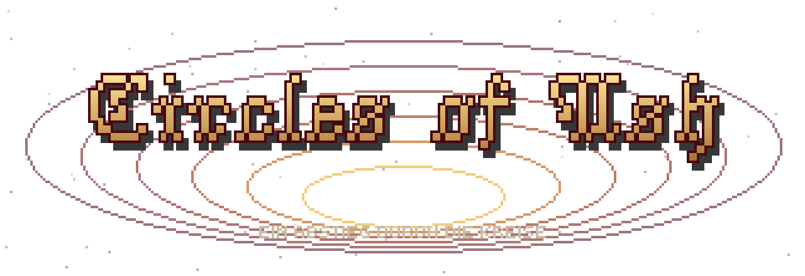
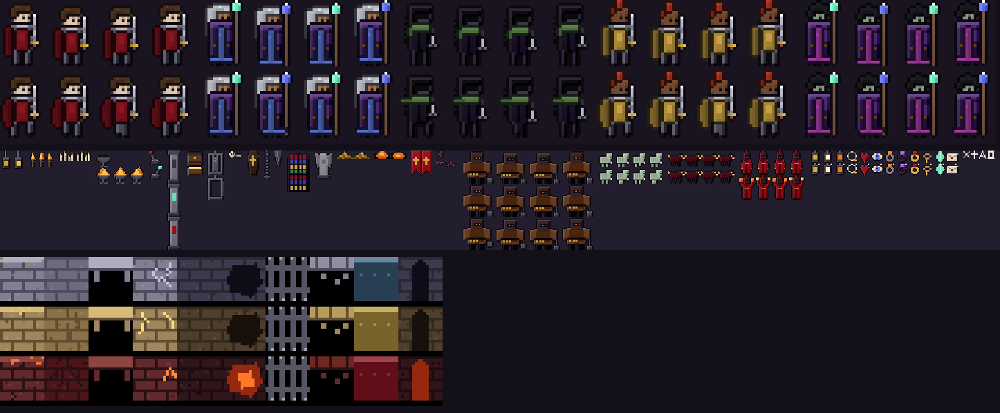
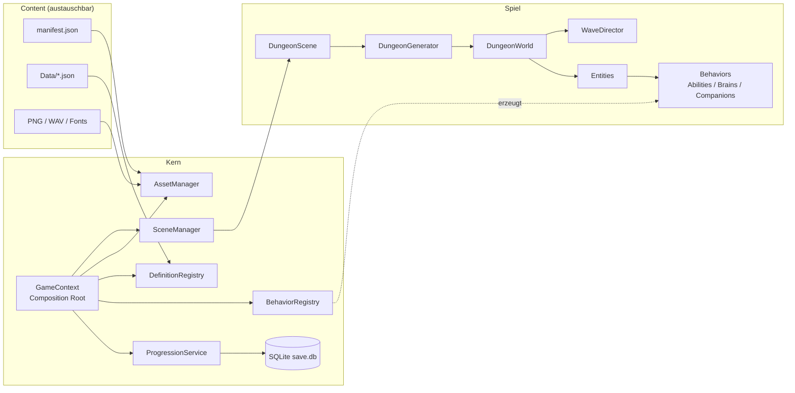
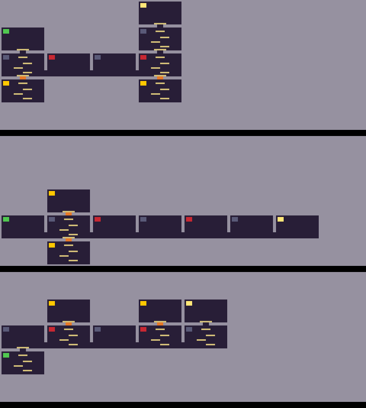
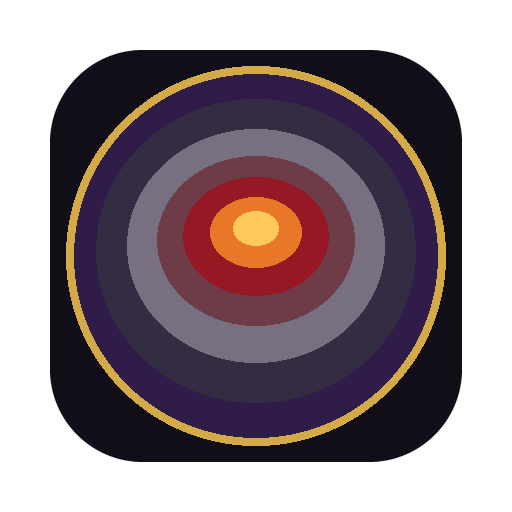

<p align="center"></p>

# Circles of Ash

> Ein gefallener Gott steigt durch die Kreise der Hölle hinab, um die Verdammten zu befreien –
> und wird mit jedem Gläubigen mächtiger.

**Circles of Ash** ist ein gotischer Pixel-Art-**Side-Scroller** in C#/MonoGame, der drei Genres verbindet:

| Genre | Umsetzung im Spiel |
|---|---|
| **Vampire Survivors** | Fähigkeiten feuern automatisch, Gegner kommen in Wellen, Level-Up = 1 aus 3 Upgrades |
| **Roguelike** | Prozedurale Dungeons, Permadeath: Tod setzt den Lauf **und die Klasse** zurück |
| **Metroidvania** | Dungeons sind Raumnetze mit vertikalen Schächten, Minikarte und Sperren (rissige Wände), die erst mit Boss-Fähigkeiten passierbar sind |



<sub>Die Vorschaubilder in `docs/` sind von Hand gemacht und zeigen einen älteren Platzhalter-Stand –
Figuren, Kleidungsstufen und Tilesets sind im Spiel inzwischen weiter.</sub>

---

## Inhalt

1. [Spielkonzept](#spielkonzept)
2. [Schnellstart](#schnellstart)
3. [Steuerung](#steuerung)
4. [Der Tempel (Hub)](#der-tempel-hub)
5. [Optionen & Schwierigkeit](#optionen--schwierigkeit)
6. [Sprachen](#sprachen)
7. [Projektstruktur](#projektstruktur)
8. [Architektur](#architektur)
9. [Technische Entscheidungen](#technische-entscheidungen)
10. [Erweitern – Schritt für Schritt](#erweitern--schritt-für-schritt)
11. [Assets austauschen & Mods](#assets-austauschen--mods)
12. [Spielstand (SQLite)](#spielstand-sqlite)
13. [Auslieferung & Release](#auslieferung--release)
14. [Roadmap](#roadmap)
15. [Lizenz](#lizenz)

---

## Spielkonzept

```
Welt "Das Inferno"
 └─ Kreis 1 … 9          ← die neun Kreise nach Dante, jeder mit eigener Farbwelt und eigenem Boss
     └─ Verlies 1 – 2    ← Wellen-Dungeons, werden pro Stufe schwerer
     └─ Verlies 3        ← Thronsaal: reiner Bosskampf, keine Wellen
```

| # | Kreis | Boss | Farbwelt |
|---|---|---|---|
| 1 | Limbus | Der Namenlose Hirte | grau-blau |
| 2 | Wollust | Der Sturm der Zwei | rosé |
| 3 | Völlerei | Kerberos, der Dreifache Schlund | fauliges Olivgrün |
| 4 | Gier | Mammon, der Gierschlund | gold |
| 5 | Zorn | Der Zornige Titan | rostrot |
| 6 | Ketzerei | Der Erzketzer im Feuersarg | glutorange |
| 7 | Gewalt | Der Minotaur der Blutfurt | totes Grün |
| 8 | Betrug | Geryon, das ehrliche Gesicht | violett |
| 9 | Verrat | Luzifer im Eis | eisblau |

**Stand v1.3.0 in Zahlen:** 9 Kreise · 27 Verliese (3 je Kreis, `balance.json`) · 9 Bosse und
3 Kerkermeister, jeder mit eigener Arena und eigenem Musikstück · 25 Gegnerarten · 4 Klassen ·
7 Begleitseelen · 13 Fähigkeiten · 20 Items · 6 Rätseltypen · 20 Bitten der Gläubigen · 24 Musikstücke.

**Nach jedem Verlies entscheidest du selbst:** sofort weiter hinab, oder zurück in den Tempel.
Der Tempel ist die sichere Wahl – der Lauf ist gespeichert, beim nächsten Aufbruch steigst du an
derselben Stelle wieder ein, und dazwischen kannst du ausrüsten, Bitten annehmen und Gläubige
ausgeben. Weitergehen spart den Umweg, aber unten wartet der Tod: Er kostet Klasse, Items und drei
Viertel der Gläubigen.

- **Verliese** werden prozedural erzeugt. In Arena-Räumen versiegeln sich die Türen und Wellen spawnen.
  Sind alle Arenen geläutert, erwacht das **Siegel** – wer es erreicht, schließt das Verlies ab.
- **Bosse** kämpfen in Phasen (datengetrieben). Ein Sieg schaltet eine **Ewige Gabe** frei, die
  **dauerhaft** erhalten bleibt – auch nach dem Tod (z. B. Dash, Doppelsprung, Jüngstes Gericht).
- **Gläubige** erhältst du durch befreite Verliese, Kreise und Welten. Sie machen dich als Gott stärker
  (+Schaden, +Leben) und wecken neue **Begleitseelen**. Beim Tod bleibt nur ein Teil treu (Standard 25 %).
- **Klassen**: Kreuzritter (Nahkampf), Magier (Fernkampf/Mana), Schatten (Tarnung + Bonusschaden),
  Engel (Flügel als Funktion). Beim Tod ist die Klasse vergessen – du wählst neu.
- **Begleitseelen**: Angreifer, Heiler oder Manaspender, die dir folgen.
- **Metroidvania-Sperren**: Schatzräume liegen hinter rissigen Wänden. Erst mit dem *Abgrundschritt*
  (Belohnung des ersten Bosses) kommst du hinein – in allen künftigen Läufen.

### In v1.0.0 dazugekommen

| Feature | Was passiert im Spiel | Wo im Code / in den Daten |
|---|---|---|
| **Charakter-Editor** | Name, Klasse, Hautton, Frisur, Haar- und Wappenfarbe; F5 würfelt. Die alten Charaktere sind jetzt **Klassen** | `Scenes/CharacterCreatorScene.cs`, `Assets/LayeredSprite.cs`, `Data/appearance.json` |
| **Abstieg spürbar** | Jeder Kreis hat eigenes Tileset, dunkleres Umgebungslicht, mehr Verfall (zerbrochene Wände, **bröckelnde Plattformen**) und eigene Partikel (Staub → Asche → Glut) | `World/LightingSystem.cs`, `World/CrumbleSystem.cs`, `worlds.json` (`ambientLight`, `decay`) |
| **Licht & Laternen** | 2D-Licht ohne Shader: Fackeln, Laternen, Fenster, Glutspalten. Getragene **Laternen** vergrößern dein Licht | `LightingSystem`, `items.json` (`LightRadius`) |
| **Items & Truhen** | Laternen, Amulette, Ringe mit Boni. Truhen mit Beute, Schatzkammern mit besserer Beute. Inventar im Pause- und Kreis-Menü | `Progression/EquipmentService.cs`, `Scenes/InventoryScene.cs` |
| **Bitten der Gläubigen** | Missionen annehmen (sammeln, töten, befreien, Kreis abschließen) → Gläubige als Lohn. Fortschritt bleibt nach dem Tod | `Progression/MissionService.cs`, `Scenes/MissionBoardScene.cs`, `missions.json` |
| **Räume mit Persönlichkeit** | Krypta, Tropfsteinhöhle (zerklüftet, **Fledermäuse flattern davon**), Kathedrale, überfluteter Kreuzgang (**Teich** zum Schwimmen), Schatzgewölbe, Glutschmiede … | `themes.json`, `props.json`, `Props/PropBehaviors.cs` |
| **Mehrere Wege** | Der Generator baut Parallelrouten (Umwege) neben dem Hauptpfad | `DungeonGenerator.AddDetours` |
| **Rätsel & Siegeltor** | Das Siegel steht hinter einem Gittertor. Sechs Typen öffnen es: verteilte **Hebel**, **Runenfolge** (Hinweis-Inschrift in einem anderen Raum), **Feuerbecken** auf Zeit, **Gewichte**, **Spiegel** und der **Lichtkranz**. Welche ein Kreis würfeln darf, steht in `worlds.json` | `Puzzles/Puzzles.cs`, `worlds.json` (`puzzles`) |
| **Kerker & Mini-Boss** | Drei Kreise (Limbus, Gier, Zorn) haben ein Verlies mit optionalem Kerker. Besiege den Kerkermeister → Gefangene frei → **neue Begleitseele** | `WaveDirector`, `worlds.json` (`prison`), `companions.json` (`unlockAtBelievers: -1`) |
| **Logo & Ladebildschirm** | Animierter Höllentrichter, Asche, Tipps, echter Fortschritt (Assets werden vorgeladen) | `Scenes/LoadingScene.cs`, `UI/InfernoFunnel.cs`, `tips.json` |

### Neu in v1.3.0

| Feature | Was passiert im Spiel | Wo im Code / in den Daten |
|---|---|---|
| **Kleidung flicken statt nur verlieren** | Kleidung ist weiter Rüstung und zerfällt in drei Stufen – aber es gibt jetzt zwei Wege zurück. Die **Glutschmiede** im Tempel flickt gegen Gläubige eine Stufe, und wenn gar nichts mehr da ist, webt sie deine Startkleidung neu: **zerfetzt, nicht heil**. Der Preis steigt mit jeder Reparatur im selben Lauf | `Scenes/ForgeScene.cs`, `EquipmentService.Mend`, `balance.json` (`forge*`) |
| **Der Trauernde Engel** | Genau **einer je Wellenverlies**, gefunden statt gekauft: eine Stufe zurück, danach ist er verbraucht. Steht bevorzugt abseits des Hauptwegs – nie im Thronsaal und nie hinter einer Dash-Sperre | `Props/PropBehaviors.cs` (`MendShrineProp`), `props.json` (`mending_angel`), `DungeonGenerator.PlaceMendShrine` |
| **Ab- und Anlegen repariert nicht mehr** | Kleidung merkt sich ihren Zustand über das Ablegen hinweg. Vorher setzte jedes Anlegen die Haltbarkeit auf voll – im Inventar beliebig oft, der ganze Verfall war damit umgehbar | `RunState.ArmorWear`, `EquipmentService.Toggle` |
| **Lichtkranz** | Sechster Rätseltyp: vier Runensäulen im Kreis, eine zu berühren kippt **sie und ihre beiden Nachbarn**, die äußeren gelten als benachbart. Alle vier zum Leuchten bringen. Kein Zeitdruck, keine Reihenfolge, kein Fehlschlag | `Puzzles/Puzzles.cs` (`RuneCirclePuzzle`), `worlds.json` (`puzzles`) |
| **Spiegel sind nicht mehr jedes Mal dieselben** | Welches Spiegelpaar den Strahl hebt und in welchen Spalten alles steht, wird gewürfelt. Der Generator **rechnet nach**, dass genau eine Stellung löst, und würfelt sonst neu | `Puzzles/BeamTracer.cs`, `DungeonGenerator.TryPlaceMirrors` |
| **Rätsel ziehen mit der Tiefe an** | Feuerbecken-Zeitlimit sinkt von 14 s auf 9 s, tiefere Kreise bekommen vier Druckplatten statt drei. Alles in `balance.json`, ohne Neukompilieren | `balance.json` (`puzzleScaling`), `PuzzleScalingDefinition` |
| **Die Erreichbarkeitsprüfung misst wieder** | Sie schlug auf **86 %** aller Verliese an – ein Fehler in ihr selbst: Die Flutfüllung startete auf der massiven Bodenkachel und lief nie los. Jetzt 0 Befunde, und der Seed-Sweep prüft vorab mit einer Gegenprobe, dass sie überhaupt noch anschlägt | `DungeonReachability`, `tools/SeedSweep` |
| **Gewürfelte Rätsel kommen auch vor** | 28 % der Rätselverliese verwarfen ihr Rätsel still und wurden zur Hebelsuche, weil kein Raum mit heilem Boden übrig war. Jetzt wird einer vorgemerkt, bevor Umwege und Abzweige Schächte hineinschneiden: **1,2 %** | `RoomNode.KeepFloorIntact`, `DungeonGenerator.ReservePuzzleRoom` |

### Neu in v1.2.0

| Feature | Was passiert im Spiel | Wo im Code / in den Daten |
|---|---|---|
| **Figur statt Klasse zuerst** | Der Editor fragt Name → Geschlecht → Statur (Kräftig/Normal/Trainiert) → Klasse → Aussehen. Geschlecht und Statur sind zwei Zeilen, liegen in den Daten aber weiter in **einer** Liste – ein Katalog rechnet hin und her, deshalb ohne Migration | `Scenes/CharacterCreatorScene.cs`, `Progression/BodyTypeCatalog.cs`, `appearance.json` |
| **Alles geht kaputt, wie in Ghosts 'n Goblins** | Jede Klasse startet in ihrer **eigenen** Kleidung, und Kleidung **ist** Rüstung: Sie fängt Treffer **ganz** ab und zerfällt dabei in **drei sichtbaren Stufen** – heil, angeschlagen, zerfetzt –, bis nur die Unterwäsche bleibt. Unzerstörbare Rüstung gibt es nicht – aber seit v1.3.0 einen Weg zurück (siehe unten) | `Progression/EquipmentService.cs` (`Stages`, `ArmorStage`), `Entities/Player.cs`, `items.json` (`armorHits`), `classes.json` (`startingArmor`) |
| **Unterwäsche mit Muster** | Die einzige unzerstörbare Ebene, und reiner Gag: schlicht, Herzchen, Streifen, Punkte, Flämmchen, Knöchlein – sechs Muster. Gewürfelt wird **pro Lauf**, nicht im Editor gewählt | `appearance.json` (`underwearStyles`), `RunState.Underwear`, `tools/assetgen/characters.py` (`underwear_frame`) |
| **Waffen liegen in der Hand** | Alle sechs Körpertypen laufen mit dem Unterarm auf **eine** gemeinsame Faustzelle zu; Faust und Waffe hängen an demselben Anker und schwingen mit Lauf und Sprung mit. Die Waffe liegt in einer eigenen, unzerstörbaren Ebene – sie bleibt also auch dann in der Hand, wenn die Kleidung zerfallen ist | `tools/assetgen/characters.py` (`hand_anchor`, `gear_frame`), `classes.json` (`gearSprite`) |
| **Selbst kämpfen** | Kombo aus drei Schlägen, Block mit Parade-Fenster, Drehsprung auf `W`. Im Optionsmenü wählbar, ob im Bosskampf die Automatik mithilft oder schweigt | `Entities/Player.cs`, `Scenes/SettingsScene.cs` |
| **Ducken** | Durch niedrige Spalten, die sonst den Weg nehmen | `Player.UpdateCrouch` |
| **Sprechende Begleitseelen** | Sie melden sich von selbst: beim Abstieg, bei wenig Leben, wenn die Kleidung zerfällt, im Tempel. Als Sprechblase, die das Spiel **nicht** anhält | `Companions/CompanionChatter.cs`, `chatter.json` |
| **Begleiter-Fassungen** | Jede der sieben Seelen in drei Farbfassungen – im Tempel über „Gestalt wechseln", haltbar über Läufe | `Companions/CompanionSkins.cs`, Migration V4 (`pets.skin`) |
| **Optionales Tutorial** | Zehn Schritte, jeder wartet auf **eine** Handlung. Kein Zwang, `F5` bricht ab. Nutzt dieselben Ereignisse wie die Zwischenrufe – eine Meldestelle für beide | `Tutorial/TutorialDirector.cs`, `tutorial.json` |
| **Zwei neue Rätseltypen** | **Gewichte**: Druckplatten gleichzeitig beschweren, aber es gibt immer einen Schiebeblock zu wenig – auf der letzten Platte stehst du selbst. **Spiegel**: einen Lichtstrahl umlenken, flach gestellte Spiegel lassen ihn durch | `Puzzles/Puzzles.cs`, `props.json`, `worlds.json` (`puzzles`) |
| **Eigene Arena je Boss** | Alle zwölf Kämpfe – neun Kreis-Bosse und drei Kerkermeister – haben eigene Geometrie, Deko, Lichtstimmung und ein eigenes Musikstück. Beim Kerkermeister wechselt es mitten im Verlies und danach zurück | `arenas.json`, `DungeonGenerator.BuildArena` |
| **Drachen** | Als Gegner (Drachenjunges ab Limbus, Aschdrache ab Gier) und als Begleiter | `enemies.json`, `companions.json`, `worlds.json` |
| **Flügel, Make-up, Körpertypen** | Eigene Sprite-Ebenen im Editor; Flügel tragen zugleich die Gleitfunktion | `Progression/CharacterVisuals.cs`, `appearance.json` |
| **16-Bit-Grafik, 24 × 32** | Figuren größer und in mehr Farbtönen; die Kollisionsbox leitet sich aus der Sprite-Größe ab, statt fest im Code zu stehen | `tools/assetgen/*.py`, `Assets/LayeredSprite.cs` |
| **Weniger Gedränge** | Kleinere Wellen und ein Deko-Regler – alles in `balance.json` nachjustierbar | `balance.json`, `WaveDirector` |

---

## Schnellstart

**Voraussetzung:** [.NET 8 SDK](https://dotnet.microsoft.com/download) (oder neuer). Mehr nicht –
MonoGame und SQLite kommen automatisch über NuGet.

```bash
git clone https://github.com/LevinTheDoctor/CiclesOfAsh.git
cd CiclesOfAsh
dotnet run --project src/CirclesOfAsh
```

### Fertiges Paket für das eigene System (ein Befehl)

```bash
./build/build.sh
```

Ohne Argument erkennt das Skript das laufende System und baut das passende, eigenständige Paket:
macOS → `publish/osx-*/CirclesOfAsh.app` (es delegiert dafür an `build/macos-app.sh`),
Linux → `publish/linux-*/` mit Binary, Startskript `CirclesOfAsh.sh` und `circlesofash.desktop`,
Windows → `publish/win-x64/CirclesOfAsh.exe`. Ein Runtime Identifier als Argument
(`./build/build.sh linux-arm64`) übergeht die Erkennung.

### Windows-Build (eigenständig, ohne installiertes .NET beim Spieler)

```powershell
.\build\publish-windows.ps1
# -> publish\win-x64\CirclesOfAsh.exe
```

### Andere Betriebssysteme

Das Projekt nutzt **MonoGame DesktopGL** (OpenGL + SDL2) und ist damit ohne Codeänderung
plattformübergreifend. Nur der Runtime Identifier ändert sich:

```bash
./build/publish.sh linux-x64
./build/publish.sh osx-arm64
```

Für macOS gibt es ein fertiges Programmbündel statt einer nackten Binärdatei:

```bash
./build/macos-app.sh osx-arm64     # Apple Silicon
./build/macos-app.sh osx-x64       # Intel
# -> publish/osx-arm64/CirclesOfAsh.app
```

Mehr dazu unter [Auslieferung & Release](#auslieferung--release).

---

## Steuerung

| Aktion | Tastatur | Gamepad |
|---|---|---|
| Bewegen | A / D oder ← / → | Linker Stick / D-Pad |
| Springen (halten = höher) | Leertaste / K | A |
| Durch Plattform fallen | S + Springen | Runter + A |
| Ducken | S / ↓ gedrückt halten | Steuerkreuz runter |
| Dash *(Ewige Gabe)* – mit W/S vertikal | Shift / L | RB / B |
| Angreifen (Kombo aus drei Schlägen) | J | RT / R2 / ZR |
| Blocken – früh gedrückt = Parade | K | LT / L2 / ZL |
| Drehsprung | W | Steuerkreuz hoch |
| Fähigkeit 1 (z. B. Schleier) | Q | X |
| Fähigkeit 2 (z. B. Jüngstes Gericht) | E | Y |
| Benutzen (Hebel, Truhe, Rune, Feuer) | F / W | LB / D-Pad hoch |
| Schwimmen (im Wasser) | Springen mehrfach | A mehrfach |
| Menü bestätigen | Enter | A / Start |
| Zufällige Gestalt (Editor) | F5 | Back |
| Pause / Zurück | Esc / P | Start / B |

Menüs gehen auch mit der **Maus**: Reiter und Zeilen sind anklickbar, Regler lassen sich ziehen
(auch über den Balken hinaus), das Scrollrad blättert. Das Spiel merkt sich, welches Gerät zuletzt
benutzt wurde, und beschriftet die Hinweise entsprechend (`Core/InputState.cs`).

Die Fähigkeiten feuern weiterhin automatisch, sobald Abklingzeit und Mana passen. **Zusätzlich**
gibt es einen manuellen Nahkampf: Schlagkombo, Block mit Parade und Drehsprung, alle drei über die
Ausdauerleiste unter Leben und Mana begrenzt. Der dritte Schlag einer Kombo trifft deutlich härter,
ein früh gesetzter Block pariert den Treffer vollständig und stößt den Angreifer zurück.

Tastenbelegung: `Core/InputState.cs`, Controller-Beschriftungen: `Content/Data/controllers.json`.

### Controller-Profile

Das Spiel erkennt am Gerätenamen, welcher Controller angeschlossen ist, und beschriftet alle
Hinweise im Spiel entsprechend – Xbox zeigt `A`, PlayStation `X`/`○`/`□`/`△`, Switch die
vertauschte Belegung `B`/`A`/`Y`/`X`, Steam Deck wie Xbox. Ohne Controller stehen dort die Tasten.

Die Profile sind reine Daten: `Content/Data/controllers.json`. Ein neuer Controller braucht dort
nur einen Eintrag mit `match` (Textbausteine im Gerätenamen), `labels` und `glyphs` – kein
Codeeingriff. Das Auffangprofil ist das mit leerem `match`; genau eines davon muss es geben.

### Tastenbilder (Controller-Glyphen)

Zu jeder Familie gibt es ein Blatt mit Tastenbildern in Pixel-Art, erzeugt von
`tools/assetgen/interface.py`:

| Blatt | Inhalt |
|---|---|
| `glyphs.xbox` | A B X Y (grün, rot, blau, gelb), LB RB LT RT, Menü, Ansicht, LS RS – dazu L1 R1 L2 R2 und Start/Select für Steam Deck und 8BitDo |
| `glyphs.playstation` | ✕ ○ □ △ in ihren Farben, L1 R1 L2 R2, Options, Create, L3 R3 |
| `glyphs.switch` | A B X Y, L R ZL ZR, + und −, LS RS |
| `glyphs.keyboard` | eine leere Tastenkappe – das Spiel schreibt die Taste darauf und zieht sie für lange Namen in die Breite |

Alle Controller-Blätter haben zusätzlich Steuerkreuz (`dpad`, `dpad_up` …), den Lauf-Stick
(`stick`) und einen leeren Rundknopf (`round`). **Die Einzelbilder heißen genau wie die
Beschriftungen** in `controllers.json` (`"A"`, `"RB"`, `"○"`, `"Menü"`), das Feld `glyphs` eines
Profils wählt nur das Blatt. Fehlt ein Bild – etwa für die Nummern „1“ bis „10“ eines Logitech-Pads
im DirectInput-Modus –, beschriftet `UI/ButtonGlyphs.cs` den leeren Rundknopf.

Zu sehen sind sie im Optionsmenü unter **Steuerung**: eine Legende aller Aktionen mit dem Bild des
erkannten Controllers, und über die Zeile **Tastenbilder** lassen sich alle Familien auch ohne
angeschlossenen Controller durchblättern. Die Belegung selbst ist unverändert; Hinweise im Spiel
schreiben die Tasten vorerst weiter als Text – der Umstieg auf die Bilder gehört zur Überarbeitung
der Steuerung (Roadmap).

Vibration hängt an `DungeonWorld.ShakeCamera`: Jeder wuchtige Moment erschüttert ohnehin schon die
Kamera, also vibriert der Controller im selben Maß. Stärke = Regler im Optionsmenü × Schwierigkeitsstufe.

---

## Der Tempel (Hub)

Zwischen zwei Abstiegen steht man nicht in einem Menü, sondern im **begehbaren Tempel der Gläubigen**.
Man läuft hin und benutzt, was man braucht:

| Ort | Was dort passiert |
|---|---|
| **Höllentor** (rechts, glühender Schlund) | Öffnet die Kreis-Übersicht – von dort geht es hinab |
| **Truhe** (links) | Ausrüstung des laufenden Abstiegs |
| **Glutschmiede** (links neben der Truhe) | Kleidung gegen Gläubige flicken – oder, wenn nichts mehr da ist, die Startkleidung neu weben (zerfetzt). Der Preis steigt mit jeder Reparatur im Lauf |
| **Missionsbrett** (linkes Podest) | Bitten der Gläubigen annehmen und aufgeben |
| **Schrein** (rechtes Podest) | Gesammelte Reliquien über alle Läufe |
| **Tempelwärtin** (Mitte) | Dialog: Hinweise, Erklärungen zu den Haustieren |
| **Begleitseelen** (laufen frei herum) | Streicheln und füttern – hebt Stimmung und Loyalität |
| **Deko-Modus** (F5) | Deko frei platzieren, kostet Gläubige, bleibt gespeichert |

Der Tempel ist in `Scenes/HubScene.cs`; sein Grundriss entsteht in `BuildHubMap()`. Die festen
Standorte stehen als Properties (`GateSpot`, `ChestSpot`, `ForgeSpot`, `BoardSpot`, `ShrineSpot`) an
einer Stelle, damit Erkennung und Darstellung nicht auseinanderlaufen. Die Tempelfigur zieht sich um,
sobald sich die Kleidung geändert hat – es gibt keinen Rückruf beim Schließen einer aufgesetzten
Szene, also vergleicht `RefreshPlayerLook()` den Zustand.

---

## Optionen & Schwierigkeit

Das Optionsmenü (`Esc` → Optionen, `Scenes/SettingsScene.cs`) hat **fünf Reiter** – `Q`/`E`
(Gamepad X/Y) wechselt den Reiter, hoch/runter die Zeile, links/rechts den Wert. Alles wirkt sofort
und wird in SQLite gesichert:

* **Bildschirm** – Größe (Auto = füllt den Bildschirm, oder pixelgenau 1×–6× der virtuellen 480×270), Vollbild, VSync.
  Das Fenster lässt sich außerdem frei ziehen oder maximieren – das Bild wächst mit
* **Audio** – Master, Musik und Effekte getrennt regelbar; beim Ändern der Effekte spielt ein Probe-Sound
* **Steuerung** – zeigt den erkannten Controller, sein Profil aus `controllers.json` und eine Legende
  aller Aktionen mit den [Tastenbildern](#tastenbilder-controller-glyphen); die Zeile
  „Tastenbilder“ blättert durch Xbox, PlayStation, Switch und Tastatur. Das freie Umbelegen der
  Tasten steht noch auf der [Roadmap](#roadmap)
* **Gameplay** – Helligkeit (gegen zu dunkle Verliese), Vibration, Schadenszahlen, Tutorial an/aus,
  Bosskämpfe selbst bestreiten, Schwierigkeit
* **Sprache** – Deutsch oder Englisch, je mit Flagge und dem Namen in der eigenen Sprache. Die
  Flagge der aktiven Sprache steht auch vor dem Reitertitel – wer sich in eine Sprache verirrt, die
  er nicht liest, findet so zurück. Umgeschaltet wird sofort, auch mitten im Verlies (siehe [Sprachen](#sprachen))

### Schwierigkeitsstufen

Vier Stufen in `Content/Data/difficulties.json`: **Büßer**, **Gläubiger** (Standard), **Märtyrer**,
**Verdammter**. Alle Werte sind Multiplikatoren und greifen an je einer Stelle im Code:

| Feld | Wirkung |
|---|---|
| `enemyHealth`, `enemyDamage`, `enemySpeed` | Gegnerwerte beim Spawn (`DungeonWorld.SpawnEnemy`) |
| `waveSize` | Wellengröße (`WaveDirector`) |
| `healMultiplier` | Wie viel ein Herz heilt |
| `xpMultiplier` | Seelen-Ertrag (`DungeonWorld.GainExperience`) |
| `rewardMultiplier` | Gläubige pro geschafftem Verlies |
| `believerRetention` | Anteil der Gläubigen, der den Tod überdauert |
| `rumbleMultiplier` | Vibrationsstärke |

Eine eigene Stufe ist ein weiterer Eintrag in der JSON – kein Codeeingriff. Die Stufe `devout` muss
existieren, sie ist der Rückfallwert.

---

## Sprachen

Das Spiel gibt es auf **Deutsch** und **Englisch**; gewählt wird im Optionsmenü unter **Sprache**
(Flaggen). Die Wahl steht in der Tabelle `settings` (Schlüssel `language`) und gilt ab dem nächsten
Bild – Menüs, HUD, Ansagen, Dialoge, Namen und Beschreibungen, auch das Logo (sein Untertitel wird
seit der Mehrsprachigkeit zur Laufzeit geschrieben, nicht mehr ins Bild gebacken).

### Wie übersetzt wird

**Der Schlüssel ist der deutsche Quelltext** – wie bei gettext:

```csharp
_menu.Add(Loc.T("Neuer Lauf"), …);                                  // fester Text
Loc.T("Gläubige: {0}   ·   Tode: {1}", meta.Believers, meta.Deaths); // Vorlage mit Werten
```

```json
// Content/Lang/en.json
"Neuer Lauf": "New run",
"Gläubige: {0}   ·   Tode: {1}": "Believers: {0}   ·   Deaths: {1}"
```

* **Code:** Jeder sichtbare Text läuft durch `Loc.T(...)` (`Localization/Loc.cs`). Texte in
  Konstanten oder Tabellen werden mit `Loc.N(...)` markiert und erst beim Anzeigen übersetzt.
* **Inhaltsdaten:** Namen, Beschreibungen, Lore, Dialog- und Tutorialzeilen, Zwischenrufe und Tipps
  sind in den Definitionen vom Typ `LocalizedText` (`Localization/LocalizedText.cs`). In der JSON
  steht weiter der deutsche Text; die implizite Umwandlung in `string` liefert beim Anzeigen die
  gewählte Sprache. Keine Anzeigestelle kann das Übersetzen vergessen.
* **Fehlt eine Übersetzung**, erscheint der deutsche Text – nie ein leeres Feld oder ein Schlüssel.

Warum nicht Schlüssel wie `"menu.new_run"`? Deutsch stünde dann doppelt im Projekt (Code bzw. Daten
**und** `de.json`), der Code würde unlesbarer, und ein vergessener Eintrag zeigte einen rohen
Schlüssel. So bleibt Deutsch die eine Quelle, und eine neue Sprache ist genau eine Datei.

### Prüfen: `tools/LangCheck`

```bash
dotnet run --project tools/LangCheck          # alle Sprachen
dotnet run --project tools/LangCheck -- en    # nur Englisch
```

Das Werkzeug sammelt jeden Text aus `Loc.T`/`Loc.N` im Code und jeden `LocalizedText` der
Inhaltsdaten (per Reflection, niemand pflegt eine Liste) und meldet je Sprache:

| Befund | Bedeutung |
|---|---|
| `FEHLT` | Quelltext ohne Übersetzung – wird als fertige JSON-Zeile ausgegeben, zum Einfügen |
| `PLATZHALTER` | `{0}`, `{name}` … stimmen zwischen Quelle und Übersetzung nicht überein |
| `VERWAIST` | Eintrag, dessen Quelltext es nicht mehr gibt (meist ein umformulierter deutscher Text) |
| `INTERPOLIERT` | `Loc.T($"…")` – ein interpolierter Schlüssel findet nie eine Übersetzung |

Rückgabewert 0 = vollständig. Die CI (`build.yml`, Job `translations`) lässt es bei jedem Push laufen.
**Wer einen deutschen Text ändert, ändert damit den Schlüssel** – LangCheck meldet dann den alten
Eintrag als verwaist und den neuen als fehlend.

### Neue Sprache

1. `Content/Lang/<id>.json` nach dem Vorbild von `en.json` anlegen (Dateiname = Id, z. B. `fr`),
   mit `name` (in der eigenen Sprache), `flag` und `order`.
2. Flagge in `tools/assetgen/interface.py` (`FLAGS`) ergänzen, Assets neu erzeugen und in
   `manifest.json` als `flag.<id>` und `flag.<id>.small` eintragen.
3. `dotnet run --project tools/LangCheck -- <id>` listet jeden fehlenden Text.

Die Pixelschrift kennt alle westeuropäischen Buchstaben (Latin-1 plus Œ/œ, „“ ‚‘ « » €), eine
neue Sprache braucht also keine neue Schrift. Auch Mods können eine Sprache mitbringen oder
ergänzen: `Mods/<Name>/Lang/en.json` legt sich Eintrag für Eintrag über die mitgelieferte.

---

## Projektstruktur

```
CirclesOfAsh/
├─ src/CirclesOfAsh/
│  ├─ Content/                  ← ALLE austauschbaren Inhalte (wird neben die .exe kopiert)
│  │  ├─ manifest.json          ← Asset-IDs → Dateien, Spritesheet-Raster, Animationen
│  │  ├─ Data/*.json            ← Klassen, Fähigkeiten, Gegner, Welten, Upgrades, Balancing
│  │  ├─ Lang/*.json            ← Sprachen: deutscher Quelltext → Übersetzung (de ist die Quelle)
│  │  ├─ Textures/ Fonts/ Audio/
│  ├─ Core/          Game-Loop-Infrastruktur: Szenen, Eingabe, Kamera, ContentLocator, Log
│  ├─ Assets/        Laufzeit-Laden von PNG/WAV/Fonts, Spritesheets, Animationen
│  ├─ Definitions/   Datenklassen (1:1 JSON) + Laden/Validieren
│  ├─ Localization/  Loc (Übersetzen), Localizer (Sprachen laden/umschalten), LocalizedText (Datentexte)
│  ├─ Modding/       BehaviorRegistry: JSON-Schlüssel → C#-Klassen
│  ├─ World/         Kachelkarte, Physik, Generator, Wellen, Licht, Bröckeln, Laufzeitwelt
│  ├─ Entities/      Spieler, Gegner, Projektile, Pickups, Props, Begleiter, Effekte
│  ├─ Props/         Verhalten der Weltobjekte (Fledermäuse, Hebel, Truhen, Käfige …)
│  ├─ Puzzles/       Rätsel vor dem Siegeltor (Hebel, Runenfolge, Feuerbecken, Gewichte, Spiegel, Lichtkranz)
│  ├─ Abilities/     Fähigkeits-Verhalten (Projektil, Nova, Orbit, Dash …)
│  ├─ Enemies/       Gegner-KI (Brains) und Boss-Angriffe
│  ├─ Companions/    Begleiter-Verhalten
│  ├─ Dialogs/       DialogService: Bedingungen, Antworten, Wirkungen (Segen, Bitten, Füttern)
│  ├─ Pets/          PetService: Name, Stimmung, Loyalität der Begleitseelen
│  ├─ Progression/   Lauf/Meta-Zustand, Regeln, Level-Up, Spieler-Factory, Items, Missionen, Einstellungen
│  ├─ Persistence/   ISaveRepository + SQLite-Implementierung mit Migrationen
│  ├─ Scenes/        Laden, Titel, Charakter-Editor, Tempel, Kreis-Übersicht, Dungeon, Dialog, Optionen, Overlays
│  └─ UI/            HUD, Minikarte, Menüs, Panels
├─ tools/generate_placeholder_assets.py   ← erzeugt alle Platzhalter-Assets (CC0)
├─ tools/assetgen/                         ← Generator-Module: Charaktere, Kreaturen, Welt, Medien, Musik, Icons
├─ tools/SeedSweep/                        ← Kommandozeilen-Prüfer: Seeds erzeugen, Erreichbarkeit und Rätsel messen
├─ tools/LangCheck/                        ← Übersetzungsprüfung: fehlende/verwaiste Texte, Platzhalter
├─ build/build.sh                          ← ein Befehl, Paket für das laufende System
├─ build/publish.sh, macos-app.sh          ← Cross-Builds, macOS-Programmbündel
├─ build/icons/                            ← erzeugte App-Icons (.icns/.ico)
├─ docs/                                   ← Logo und Vorschaubilder für diese Datei
└─ .github/workflows/                      ← CI (build.yml) und Release für alle Systeme (release.yml)
```

---

## Architektur


```mermaid
flowchart LR
    subgraph Daten["Content (austauschbar)"]
        M[manifest.json]
        D[Data/*.json]
        A[PNG / WAV / Fonts]
    end
    subgraph Kern
        GC[GameContext<br/>Composition Root]
        SM[SceneManager]
        REG[BehaviorRegistry]
        DEF[DefinitionRegistry]
        AM[AssetManager]
        PS[ProgressionService]
        DB[(SQLite save.db)]
    end
    subgraph Spiel
        DS[DungeonScene]
        GEN[DungeonGenerator]
        DW[DungeonWorld]
        WD[WaveDirector]
        E[Entities]
        B[Behaviors<br/>Abilities / Brains / Companions]
    end
    M --> AM
    A --> AM
    D --> DEF
    GC --> SM & AM & DEF & REG & PS
    PS --> DB
    SM --> DS
    DS --> GEN --> DW
    DW --> WD & E
    E --> B
    REG -. erzeugt .-> B
```

### Verwendete Muster (kurz erklärt)

| Muster | Wo | Wozu |
|---|---|---|
| **Data-Driven Design** | `Content/Data/*.json` | Inhalte ohne Neukompilieren ändern/ergänzen |
| **Strategy** | `IAbilityBehavior`, `IEnemyBrain`, `IBossAttack`, `ICompanionBehavior` | Verhalten austauschbar, jede Variante eine Klasse |
| **Factory + Registry** | `BehaviorRegistry`, `PlayerFactory` | JSON-Schlüssel → neue Instanz; Aufbau komplexer Objekte an einer Stelle |
| **State (Scene Stack)** | `SceneManager`, `IScene` | Bildschirme als Zustände, Overlays pausieren darunterliegende Szenen |
| **Observer** | `DungeonWorld.PlayerDied / GoalReached` | Welt meldet Ereignisse, ohne Szenen zu kennen |
| **Repository** | `ISaveRepository` | Spiellogik unabhängig vom Speicherformat |
| **Composition Root** | `GameContext.Create` | Einziger Ort, an dem Dienste erzeugt und verdrahtet werden |
| **Flyweight** | `SpriteSheet` | Textur einmal laden, von vielen Entities teilen |

---

## Technische Entscheidungen

### 1. MonoGame **DesktopGL** statt WindowsDX
DesktopGL läuft identisch auf Windows, Linux und macOS. WindowsDX wäre nur Windows. Damit ist
„erstmal nur Windows bauen, später andere Systeme“ bereits erfüllt – es ist nur ein anderer `-r`-Parameter.

### 2. Assets zur Laufzeit statt MonoGame-Content-Pipeline (MGCB)
Die Pipeline kompiliert Assets in `.xnb`-Dateien – dann sind sie „fest verdrahtet“. Hier werden PNG,
WAV und JSON **direkt** geladen (`Texture2D.FromFile`, `SoundEffect.FromFile`). Vorteile:
Austausch per Drag & Drop, Mod-Support, keine zusätzlichen Build-Tools.
Kleiner Preis: Texturen haben kein vormultipliziertes Alpha → beim Zeichnen wird
`BlendState.NonPremultiplied` verwendet (siehe `UiDraw.Begin`).

### 3. Daten: **JSON für Inhalte, SQLite für den Spielstand**
Zwei unterschiedliche Arten von Daten, zwei passende Werkzeuge:

| | JSON (`Content/Data`) | SQLite (`save.db`) |
|---|---|---|
| Was | Baupläne: Klassen, Gegner, Welten, Balancing | Veränderlicher Fortschritt: Gläubige, Freischaltungen, aktueller Lauf |
| Wer ändert | Entwickler, Modder (Texteditor, Git-Diff) | Das Spiel zur Laufzeit |
| Warum | lesbar, versionierbar, überschreibbar durch Mods | atomare Transaktionen (kein halbes Savegame bei Absturz), Schema-Migrationen, Abfragen |

### 4. Virtuelle Auflösung 480×270
Alles wird in eine kleine Leinwand gerendert und aufs Fenster hochskaliert (letterboxed, 16:9).
Passt ein ganzzahliger Faktor genau (1080p = Faktor 4), wird pixelgenau gezeichnet. Bei jeder anderen
Fenstergröße – frei gezogen, maximiert, macOS-Vollbild – skaliert das Spiel **scharf-bilinear**: erst
ganzzahlig aufgerundet vergrößern, dann das letzte Stück linear verkleinern. So füllt das Bild das
Fenster, ohne dass einzelne Pixel ungleich breit oder verwaschen werden. Vollbild ist randlos in der
Desktop-Auflösung (`HardwareModeSwitch = false`), es wechselt also nie die Bildschirmauflösung.

### 5. Licht ohne Shader
Eine 480×270-Lichtkarte (Render-Target) wird pro Frame mit dem Umgebungslicht des Kreises gefüllt, Lichter
werden **additiv** hineingemalt und die Karte dann per **Multiply-Blending** über die Szene gelegt.
Magie, Partikel und das Siegel werden danach gezeichnet und leuchten dadurch "selbst". Vorteil: läuft auf
jeder Grafikkarte, kein HLSL/MGFX nötig, passt zum Pixel-Look (gestufte, geditherte Lichttextur).
Damit das Render-Target nicht die Leinwand überschreibt, gibt es `IScene.PrepareDraw`, das **vor** dem
Binden der Leinwand läuft.

### 6. Prozeduraler Metroidvania-Generator
Vier Phasen (siehe `World/DungeonGenerator.cs`):
1. **Graph** – gewichteter Random Walk durch ein Raster ergibt den kritischen Pfad (Start → Siegel).
   Wo der Pfad drei Räume geradeaus läuft, entsteht darüber/darunter eine **Parallelroute**.
   Seitenäste führen zu Schatzräumen (Durchgang **rissig**, braucht Dash) und zum optionalen **Kerker**.
2. **Themen** – jeder Raum bekommt gewichtet eine Persönlichkeit aus `themes.json`.
3. **Geometrie** – jeder Raum (30×17 Kacheln = 1 Bildschirm) wird in die Karte gefräst, Türen und
   Schächte geöffnet, Kletterplattformen passend zur Sprunghöhe gesetzt. Höhlen bekommen eine zerklüftete
   Decke, geflutete Räume einen Teich. Je nach `decay` werden Plattformen zu bröckelnden Plattformen.
   Um das Siegel entsteht ein Gittertor.
4. **Inhalt** – zuerst Pflicht-Props (Rätsel, Truhen, Käfige), dann Deko nach Thema, dann Sammelobjekte.
   Ein Spalten-Belegungsplan pro Raum verhindert Überlappungen.



Gleicher Seed ⇒ gleicher Dungeon. Der Seed steht im Log (`%APPDATA%/CirclesOfAsh/game.log`).

### 7. Erreichbarkeit messen, nicht raten

Ein prozeduraler Generator kann einen Pflichtraum einmauern. Deshalb läuft nach **jeder** Erzeugung
`DungeonReachability.Check` (`World/DungeonReachability.cs`): eine Flutfüllung vom Spielerstart über
begehbare Kacheln, die bis zu **6 Kacheln** nach oben steigen darf – so hoch springt die Figur
(≈ 96 px) – und beliebig weit fällt. Was dabei nicht besucht wird, aber besucht werden müsste
(Siegeltor, Arenen, Kerker, Schatzräume), landet als Zeile im Log.

Die Prüfung **bricht nichts ab**: ein unerreichbarer Schatzraum ist ärgerlich, ein Absturz wäre
schlimmer. Über viele Seeds hinweg lässt sie sich ohne Spielstart und ohne Grafik-Assets auslösen:

```bash
dotnet run --project tools/SeedSweep -- 200    # 200 Seeds x 9 Kreise x 3 Verliese = 5400 Verliese
```

Der Sweep geht über **alle neun Kreise**, nicht nur den ersten – sonst blieben `braziers` und
`mirrors` ungeprüft, die es im Limbus gar nicht gibt. Je Verlies prüft er dreierlei: Erreichbarkeit
der Pflichträume, Vollständigkeit und Erreichbarkeit der Rätselteile (samt Lösbarkeit des
Spiegelrätsels), und dass genau ein erreichbarer Trauernder Engel im Verlies steht. Ausgegeben wird
eine Zeile je Befund, dazu die Verteilung „Rätsel gewürfelt → gesetzt"; Einzelheiten stehen in
`seed-sweep.log` im temporären Verzeichnis. Der Rückgabewert ist 0, wenn nichts gefunden wurde.

**Vorweg läuft eine Gegenprobe:** Ein absichtlich zugemauerter Ausgangsraum **muss** gemeldet werden,
sonst bricht der Sweep ab. Das ist kein Zierrat – der frühere Befundberg von 6222 (86 % aller
Verliese) kam nicht vom Generator, sondern von der Prüfung selbst: `PlayerSpawn` ist die Fußhöhe,
also die Oberkante der Bodenkachel, und die Suche nach einem begehbaren Startpunkt ging von dort
nach **unten**, tiefer ins Gestein. Die Flutfüllung lief nie los, und ohne besuchte Kacheln galt
jeder Pflichtraum als unerreichbar. Eine Prüfung, die nichts mehr misst, meldet eben auch nichts –
deshalb misst der Sweep jetzt zuerst sich selbst.

---

## Erweitern – Schritt für Schritt

> Faustregel: **Neuer Inhalt = nur JSON.** **Neues Verhalten = eine C#-Klasse + eine Zeile in
> `Modding/BehaviorRegistry.cs`.** Beim Start prüft `DefinitionRegistry.Validate` alle Verweise und
> meldet Tippfehler gesammelt mit Klartext.

### Neue Fähigkeit mit vorhandenem Verhalten (nur JSON)

`Content/Data/abilities.json`:
```json
{ "id": "bone_storm", "name": "Knochensturm", "description": "Drei Knochen im Fächer.",
  "behavior": "projectile", "activation": "Auto", "cooldown": 1.2, "damage": 8, "damagePerLevel": 3,
  "range": 200, "speed": 200, "count": 3, "sprite": "projectile.holy_bolt", "sound": "shoot" }
```
Dann in `classes.json` bei einer Klasse unter `abilityPool` eintragen – fertig, sie erscheint beim Level-Up.

Verfügbare `behavior`-Schlüssel: `projectile`, `melee_arc`, `nova`, `orbit`, `stealth`, `dash`,
`air_jump`, `glide` (siehe `Modding/BehaviorRegistry.cs`).

### Neues Fähigkeits-Verhalten (C#)

```csharp
// src/CirclesOfAsh/Abilities/LifeStealAbility.cs
public sealed class LifeStealAbility : IAbilityBehavior
{
    public bool TryActivate(DungeonWorld world, Player owner, AbilityInstance ability)
    {
        Enemy? target = world.FindNearestEnemy(owner.Center, ability.Definition.Range);
        if (target is null) return false;                       // kein Ziel -> keine Abklingzeit
        float damage = ability.ComputeDamage(owner, owner.ConsumeStealthBonus());
        world.DamageEnemy(target, damage, owner.Center, ability.Definition.Knockback);
        owner.Health.Heal(damage * 0.25f);                      // 25 % Lebensraub
        return true;
    }
}
```
```csharp
// Modding/BehaviorRegistry.cs -> CreateWithBuiltIns()
registry.RegisterAbility("life_steal", () => new LifeStealAbility());
```
Nun kann jede Fähigkeit in JSON `"behavior": "life_steal"` nutzen.

### Neuer Gegner
1. Spritesheet nach `Content/Textures/` legen und in `manifest.json` unter `spriteSheets` eintragen
   (Animationen `idle`, optional `run`, `cast`).
2. In `enemies.json` anlegen, `brain` = `walker` | `flyer` | `caster` | `charger` | `swarmer` |
   `ambusher` | `boss`.
3. In `worlds.json` im `enemyPool` eines Kreises mit `weight` eintragen.

Eigene KI: Klasse mit `IEnemyBrain` schreiben und `registry.RegisterEnemyBrain("mein_brain", ...)`.

### Neuer Boss
Wie ein Gegner, zusätzlich `"isBoss": true`, `"brain": "boss"` und `phases`:
```json
"phases": [
  { "healthBelow": 1.0, "attacks": [ "charge", "projectile_ring" ], "pauseBetweenAttacks": 1.2 },
  { "healthBelow": 0.4, "attacks": [ "slam", "summon", "charge" ], "speedMultiplier": 1.5 }
]
```
Angriffe: `charge`, `projectile_ring`, `summon` (nutzt `summonEnemy`), `slam`.
Neuer Angriff = Klasse mit `IBossAttack` (`Begin` + `Update` bis `true`) und `RegisterBossAttack`.

### Neuer Kreis / neue Welt
In `worlds.json` einen Kreis an `circles` anhängen (Reihenfolge = Abstiegsreihenfolge) oder eine
komplette neue Welt als weiteres Objekt anlegen. Nach Befreiung einer Welt geht es automatisch mit der
nächsten weiter. Stimmung pro Kreis über `tileset`, `background`, `ambientLight` (je dunkler, desto
wichtiger werden Laternen), `decay` (0–1: zerbrochene Wände, bröckelnde Plattformen) und `ambientParticles`
(`dust`, `ash`, `embers`, `drips`). `themes` gewichtet die Raumthemen, `puzzles` die möglichen Rätsel,
`prison` legt Kerker, Mini-Boss und Belohnungs-Begleiter fest, `collectibles` die Sammelobjekte.
`bossReward` ist die **Ewige Gabe** – eine beliebige Fähigkeits-ID.

**Eigene Farbwelt dazu:** Ein Eintrag in `MATERIALS` (`tools/assetgen/world.py`) genügt – das ist die
einzige Farbquelle eines Kreises, für Kacheln **und** Hintergrund. `scenery` wählt eine der neun
Kulissen (`castle`, `cave`, `ember`, `storm`, `swamp`, `graveyard`, `arena`, `ditches`, `ice`), der
Rest sind Farben. `generate()` schreibt daraus von selbst `tiles_<id>.png` und `bg_<id>.png`; ins
`manifest.json` müssen beide noch als `tiles.<id>` und `background.<id>` eingetragen werden. Beim Start warnt das Spiel jetzt, wenn Tileset, Hintergrund
oder Musik eines Kreises fehlen – vorher fiel der Kreis still auf die Bilder des Limbus zurück.

**Wichtig:** `prison.dungeonIndex` muss **kleiner** sein als `dungeonsPerCircle - 1`, sonst läge der
Kerker auf dem Thronsaal und würde nie gebaut. Das wird beim Start geprüft
(`DefinitionRegistry.Validate`). `dungeonsPerCircle` selbst steht nicht in `worlds.json`, sondern
zentral in `balance.json` – derzeit **3**: zwei Wellen-Verliese und der Thronsaal.

### Neue Klasse
`classes.json` erweitern. Eine Klasse bringt **drei** Dinge mit:

- `gearSprite` – Waffe und die Faust, die sie hält (feste Farben, **unzerstörbar**). Alles, was mit
  der Waffe zu tun hat, gehört an den gemeinsamen Anker `hand_anchor` in `characters.py`; nur so
  sitzt es bei allen sechs Körpertypen in der Hand.
- `accentSprite` – das Klassenzeichen in **Graustufen**, wird mit der Wappenfarbe aus dem Editor
  eingefärbt. Bewusst nichts Textiles: Stoff gehört in die zerstörbare Kleidung, sonst wäre die
  Wappenfarbe nach dem letzten Treffer unsichtbar.
- `startingArmor` – die **eigene** Startkleidung als Item-Id aus `items.json` (siehe *Neues Item*).

Beide Sheets brauchen dasselbe Raster wie `char.body` (24×32, Zeilen idle/run/jump/hurt).
Stat-Namen siehe `Combat/Stats.cs` (`MaxHealth`, `MaxMana`, `ManaRegen`,
`MoveSpeed`, `JumpPower`, `Might`, `Armor`, `CooldownReduction`, `AreaSize`, `PickupRadius`, `StealthDamage`).

### Neuer Stat
1. Wert in `enum StatType` ergänzen (`Combat/Stats.cs`), ggf. Startwert in `StatSheet.Defaults`.
2. An der Stelle auslesen, wo er wirken soll: `owner.Stats[StatType.MeinStat]`.
3. Upgrades in `upgrades.json` können ihn sofort verwenden.

### Neuer Begleiter
`companions.json` + optional eigenes `ICompanionBehavior` (`attacker`, `healer`, `mana` sind vorhanden).
`unlockAtBelievers` legt fest, ab wie vielen Gläubigen er dauerhaft erwacht.

### Neues Item
`items.json`: `slot` (`Lamp`, `Amulet`, `Ring`, `Collectible`, `Armor`), `rarity` (`Common`, `Rare`,
`Sacred`), `modifiers` mit Stat-Namen, `minCircle` ab welchem Kreis es als Beute auftaucht,
`lootable: false` wenn es nie in Truhen liegen soll (so sind die vier Startkleidungen ausgenommen).
Icon: in `manifest.json` beim Sheet `items.icons` eine Animation mit der Item-ID und der Spalte
(`column`) im Icon-Atlas anlegen.

Für den Slot `Armor` kommt dazu:

- `armorHits` – wie viele Treffer das Stück **vollständig** abfängt, bevor es zerfällt. Ohne Angabe
  aus `durability` abgeleitet, **mindestens** aber `EquipmentService.Stages` (3). Unzerstörbare
  Rüstung gibt es nicht.

Wieder heil wird Kleidung nur absichtlich: an der **Glutschmiede** im Tempel gegen Gläubige oder am
**Trauernden Engel** im Verlies. Beide gehen durch `EquipmentService.Mend` – wer einen dritten Weg
einbaut, ruft dieselbe Methode auf, statt `ArmorDurability` von Hand zu setzen. Ab- und Anlegen
repariert **nicht**: Der Zustand steht in `RunState.ArmorWear` und überlebt das Ablegen. Nur ein neu
gefundenes Stück ist ganz.
- `sprite` – die Kleidungs-Ebene. Erwartet werden **drei** Blätter: `<sprite>` (heil),
  `<sprite>.worn` (angeschlagen) und `<sprite>.broken` (zerfetzt). Fehlt eine Stufe, fällt die
  Anzeige auf die nächstniedrigere zurück (nur ein `INFO` im Log, kein Fehler).

Die Ebene deckt Rumpf **und** Beine – ein Stück, das nur den Rumpf deckt, ließe unzerstörbare Hosen
übrig. Gezeichnet wird sie in `characters.py` (`garment_frame`), und der Schaden wird **nach**
`polish()` hineingeschlagen: Dessen Kontur-Schleife würde sonst jedes Loch bis 2 px Breite wieder
zumalen.

### Neues Prop / neues Raumthema
1. Prop in `props.json` (Sprite, Größe, optional Licht, `behavior`).
2. In `themes.json` einem Thema zuordnen: `{ "prop": "mein_prop", "anchor": "Ceiling", "min": 1, "max": 3 }`.
3. Eigenes Verhalten? `IPropBehavior` implementieren und in `BehaviorRegistry.CreateDefault` registrieren.
   Nur die benötigten Methoden überschreiben (Default Interface Methods).

### Neues Rätsel
`IPuzzle` implementieren (`Puzzles/Puzzles.cs` als Vorlage), registrieren (`RegisterPuzzle`), in
`worlds.json` bei `puzzles` eintragen. Props melden sich über `world.NotifyPuzzle(prop)`, das Rätsel
antwortet per `prop.Behavior.OnSignal(...)` und öffnet am Ende mit `world.OpenGate()`.
Braucht es eigene Props, müssen sie im Generator (`PlacePuzzle`) platziert werden.

**Dazu gehört ein Eintrag in `tools/SeedSweep` (`ExpectedParts`)**: welche Teile mit welchem Tag in
welcher Zahl stehen müssen. Der Sweep meldet sonst „unbekannter Schlüssel" und prüft dein Rätsel
nicht. Er prüft dann bei jedem Lauf, dass die Teile vollständig und erreichbar sind und keine Reste
eines verworfenen Rätsels herumstehen.

**Lösbarkeit gehört nachgerechnet, nicht behauptet.** Beide Fehler eines Rätsels sind im Spiel
unsichtbar: Es gibt gar keine Lösung, oder es ist beim Betreten schon gelöst und das Tor springt
ungefragt auf. Der Lichtkranz würfelt seine Startstellung deshalb **rückwärts** aus der gelösten,
und das Spiegelrätsel probiert im Generator alle Stellungen durch (`Puzzles/BeamTracer.cs`,
`DungeonGenerator.TryPlaceMirrors`) und würfelt neu, bis genau eine löst. Die Strahlenregel liegt
bewusst in einer eigenen, weltfreien Klasse – so prüfen Spiel, Generator und Sweep dieselbe Regel
statt drei leicht abweichender Kopien.

Braucht das Rätsel einen **eigenen Raum** mit fester Geometrie, gehört sein Schlüssel zusätzlich in
`DungeonGenerator.NeedsPuzzleRoom`. Zum Setzen dann `PlacePropAt` statt `PlaceProp` verwenden:
`PlaceProp` weicht auf eine zufällige Spalte aus, wenn die gewünschte belegt ist, und zerlegt damit
einen Entwurf. `PlacePropAt` meldet stattdessen Fehlschlag, und der Aufrufer weicht sauber auf
`levers` aus. Ein Raum mit Ausgang **nach unten** wird gar nicht erst gewählt – der schneidet ein
vier Kacheln breites Loch in die Bodenreihe.

### Neue Arena für einen Boss
Eintrag in `arenas.json` mit der **Gegner-Id** als `id`. Alle Koordinaten sind Raum-Kacheln
(0–29 waagerecht, 16 = Bodenreihe), nicht Weltkacheln. `platforms` sind durchspringbare Absätze,
`pillars` massive Blöcke, `props` Deko an festen Spalten. `ambientLight` und `music` wirken nur im
Thronsaal, wo die Arena das ganze Verlies ist. Ohne Eintrag bleibt es beim Standardraum.

### Neuer Tutorial-Schritt
Eintrag in `tutorial.json`. Der `trigger` muss ein Ereignis sein, das der Code auch meldet – die
Liste steht als Konstanten in `Companions/CompanionChatter.cs`, und `DefinitionRegistry.Validate`
prüft sie beim Start. Ein unbekannter Auslöser würde den Spieler sonst für immer an derselben
Aufforderung festhalten.

### Neuer NPC mit Dialog
Zwei JSON-Dateien, kein Code:
1. `dialogs.json`: ein Eintrag mit `id` und `lines`. Jede Zeile hat `id`, `text` und optional
   `choices` (`label`, `next`, `effect`, `target`). Mehrere Zeilen dürfen dieselbe `id` tragen –
   die erste, deren `if`-Bedingung passt, gewinnt. So spricht derselbe NPC je nach Fortschritt anders.
   `effect` kennt `blessing` (Segen für den Lauf), `accept_mission` und `feed_pet`.
2. `npcs.json`: `id`, `spriteSheet` (aus `manifest.json`), `dialogId`, `spawnsInDungeon`,
   `givesBlessing`, `lightRadius`/`lightColor` (damit man ihn im Dunkeln findet).

Beim Start wird geprüft, dass jeder NPC einen existierenden Dialog hat und jedes `next` auf eine
vorhandene Zeile zeigt – Tippfehler fallen sofort auf, nicht erst im Gespräch.

### Neue Bitte der Gläubigen
Nur `missions.json`: `type` (`Collect`, `Slay`, `Rescue`, `CompleteCircle`), `target` (Item-, Gegner-,
Kreis-ID oder `*`), `count`, `rewardBelievers`, optional `requiredBelievers`.

### Neue Schwierigkeitsstufe
Ein Eintrag in `difficulties.json` – alle Felder sind Multiplikatoren, siehe
[Optionen & Schwierigkeit](#optionen--schwierigkeit). Sie taucht automatisch im Optionsmenü auf.

### Neues Musikstück
In `tools/assetgen/music.py` ein `_compose(...)` mit Akkordfolge, Grundton und Melodie ergänzen und
in `Content/manifest.json` unter `"music"` eine ID vergeben. Benutzt wird sie an drei Stellen:

| Wo | Schlüssel | Wirkung |
|---|---|---|
| `worlds.json` beim Kreis | `music` | läuft in allen Verliesen des Kreises |
| `arenas.json` beim Kampf | `music` | **schlägt** das Kreisstück; beim Kerkermeister wechselt es mitten im Verlies und danach zurück |
| beliebige Szene | `Context.Music.Play("…")` | Titel, Tempel, Ladebildschirm |

`bossMusic` am Kreis ist nur noch der Rückfall für einen Thronsaal ohne Arena-Eintrag – gesetzt hat
es derzeit kein Kreis. Zeigt eine Arena auf ein Stück, das noch nicht im Manifest steht, bleibt es
beim bisherigen (`DungeonScene`, `DungeonWorld.StartArenaMusic`).

Wer echte Musik hat, ersetzt einfach die WAV-Datei – die ID bleibt.

### Balancing
Alles Globale steht in `Content/Data/balance.json` (Wellengröße, Schwierigkeitsanstieg, XP-Kurve,
Gläubigen-Bonus, Bildschirmgröße, Grundhelligkeit …). Änderungen wirken beim nächsten Start.
Werte, die vom Spieler abhängen, stehen dagegen in `difficulties.json` bzw. im Optionsmenü.

### Neue Szene
Von `SceneBase` erben, `Update`/`Draw` implementieren, mit `Context.Scenes.Push/Replace` öffnen.
Für Overlays `IsOverlay => true` überschreiben.

---

## Assets austauschen & Mods

- **Ersetzen:** Eine PNG unter gleichem Namen überschreiben. Raster (Framegröße, Zeilen) muss zu
  `manifest.json` passen – oder dort anpassen.
- **Fehlende Dateien** stürzen nicht ab: Es erscheint eine magenta-schwarze Platzhaltertextur und
  eine Warnung im Log.
- **Mods ohne Originaldateien anzufassen:** Neben der `.exe` einen Ordner `Mods/<ModName>/` anlegen.
  Er wird wie `Content/` aufgebaut und hat **Vorrang**. Ein Mod braucht nur die geänderten Dateien:
  ```
  Mods/
  └─ zz_better_ghouls/
     ├─ Textures/enemy_ghoul.png        ← ersetzt die Grafik
     └─ Data/enemies.json               ← [{ "id": "ghoul", ... }] ersetzt den kompletten Ghul-Eintrag
  ```
  JSON-Listen werden per `id` zusammengeführt: gleiche ID = überschreiben, neue ID = hinzufügen.
  Mehrere Mods: alphabetisch **später** gewinnt (`zz_` vor `aa_`).
- **Platzhalter neu erzeugen:** `python tools/generate_placeholder_assets.py` (benötigt `pip install pillow`).
  Der Lauf leert `Content/Textures/` und schreibt es neu, dazu Fonts, Sounds, Musik, die App-Icons
  sowie `docs/logo.png` und `docs/icon-preview.png`. Die übrigen Bilder in `docs/`
  (`sprites-preview.png`, `dungeon-layouts.png`, `background-preview.png`) erzeugt **kein**
  Generator – sie sind von Hand gemacht und können hinter dem Spielstand herhinken.

---

## Spielstand (SQLite)

Pfad: `%APPDATA%\CirclesOfAsh\save.db` (Windows), `~/.config/CirclesOfAsh/save.db` (Linux),
`~/Library/Application Support/CirclesOfAsh/save.db` (macOS).

| Tabelle | Inhalt |
|---|---|
| `meta` | Schlüssel/Wert: Gläubige, Tode, gestartete Läufe |
| `unlocks` | Dauerhafte Freischaltungen (`ability`, `companion`, `world`) mit Zeitstempel |
| `run` | Genau **eine** Zeile (`CHECK (id = 1)`): aktueller Lauf – Klasse, Kreis, Verlies, Stufe, Seed |
| `run_items` | Fähigkeitsstufen, Upgrades, Begleiter, Items (Anzahl) und angelegte Items (`equipped`, Slot als Zahl) |
| `run_profile` *(v2)* | Schlüssel/Wert: Name und Aussehen aus dem Charakter-Editor, Haltbarkeit und Zustand der Kleidung (`armor_durability`, `armor_wear`), genutzte Reparaturen (`forge_uses`) |
| `missions` *(v2)* | Bitten der Gläubigen: Status (`Active`/`Completed`) und Fortschritt |
| `settings` *(v3)* | Optionsmenü: Bildschirm, Lautstärken, Helligkeit, Vibration, Schwierigkeit |
| `hub_deco` *(v3)* | Im Tempel platzierte Deko (Prop-Id + Kachelkoordinate) |
| `pets` *(v3, Spalte `skin` ab v4)* | Begleitseelen: Name, Stimmung, Loyalität, letzte Fütterung, Farbfassung |
| `collectibles` *(v3)* | Gefundene Reliquien über alle Läufe (Schrein im Tempel) |

Befreite Kerker stehen in `unlocks` mit `kind = 'prison'` (Belohnung nur einmal pro Lauf).
Alte Spielstände werden beim Start automatisch bis zur aktuellen Version migriert (zuletzt **v4**:
`pets.skin`, die Farbfassung der Begleitseelen).
Fehlt in `settings` ein Schlüssel – frische Installation oder neu dazugekommene Option –, gilt der
Standardwert aus `GameSettings`; ein fehlender Wert darf nicht als 0 durchschlagen (sonst wäre das
Spiel beim ersten Start stumm).

**Schema ändern:** In `SqliteSaveRepository.Migrations` einen **neuen** SQL-Block anhängen
(z. B. `ALTER TABLE run ADD COLUMN ...`). Beim Start wird `PRAGMA user_version` gelesen und jede
fehlende Migration in einer Transaktion ausgeführt. Bestehende Einträge niemals ändern.

**Oft geht es auch ohne Migration:** `run_profile`, `meta` und `settings` sind Schlüssel/Wert-Tabellen,
ein fehlender Schlüssel liest sich als leer. Neue Werte am Lauf gehören deshalb dorthin – so kamen
`armor_wear` und `forge_uses` dazu, ohne dass das Schema über **v4** hinausgehen musste und ohne
dass ein alter Spielstand etwas merkt.

Anschauen lässt sich die Datei z. B. mit `sqlite3 save.db ".tables"` oder DB Browser for SQLite.

---

## Auslieferung & Release

### Icons

`tools/assetgen/icons.py` zeichnet das App-Icon prozedural: der Höllentrichter als Ringe, die nach
innen enger, tiefer und heißer werden. Bewusst **nicht** aus `docs/logo.png` – ein 1280×440 breiter
Schriftzug wäre bei 16×16 nicht mehr lesbar.

```bash
python tools/generate_placeholder_assets.py   # erzeugt auch build/icons/*
```

Ergebnis: `build/icons/CirclesOfAsh.ico` (Windows, in die .exe eingebettet über `<ApplicationIcon>`)
und `CirclesOfAsh.icns` (macOS, landet im `.app`). Wo `iconutil` verfügbar ist, wird es genutzt,
sonst schreibt das Skript das icns-Format selbst – die CI unter Linux kommt damit ebenfalls klar.

**Dazu kommt `src/CirclesOfAsh/Icon.bmp` – das Symbol der *laufenden* App.** Das `.icns` gilt nur,
bis das Spiel sein Fenster öffnet. Dann ruft MonoGame `SDL_SetWindowIcon` auf, und SDL setzt unter
macOS damit das Dock-Bild. Welches Bild das ist, sucht MonoGame als eingebettete Ressource
`Icon.bmp` in der Programmdatei (`SdlGameWindow`, dekompiliert geprüft) – fehlt sie, nimmt es sein
**eigenes Logo**. Genau das stand vorher im Dock, sobald das Spiel lief, auch im fertigen `.app`.
Die Datei ist deshalb über `<EmbeddedResource … LogicalName="Icon.bmp">` eingebunden und liegt im
Repository (nicht unter `build/icons/`), weil jeder Build sie braucht – auch `dotnet run`. Sie ist
eine 32-Bit-BMP mit Alphakanal (256 px), die SDL direkt lesen kann; unter Windows und Linux ist sie
zugleich das Fenstersymbol in Titelleiste und Taskleiste.

Dock-Symbol und `.icns` folgen dem macOS-Raster: die Kachel mit abgerundeten Ecken auf 824 von
1024 px, drumherum durchsichtig. Ohne den Rand zieht macOS das Bild bis an die Kachelkante, und es
wirkt größer als alle Symbole daneben. Vor und nach dem Start zeigt das Dock so dasselbe Bild.

<p align="center"></p>

### macOS-Programmbündel

`build/macos-app.sh` baut `CirclesOfAsh.app` mit `Contents/{Info.plist, MacOS/, Resources/}`.
Der gesamte Publish-Inhalt liegt unter `MacOS/`, damit die relativen Content-Pfade unverändert gelten.
Das Fenster verhält sich wie bei jeder Mac-App: frei ziehbar, grüner Knopf für Vollbild, Retina-fähig.

Das Bündel bekommt eine **Ad-hoc-Signatur** (`codesign --sign -`), ist aber **nicht von Apple
beglaubigt**. Beim ersten Start meldet sich Gatekeeper; ein Rechtsklick auf „Öffnen" oder
`xattr -dr com.apple.quarantine CirclesOfAsh.app` genügt.

Die Ad-hoc-Signatur ist kein Ersatz für eine echte, aber ohne sie schlägt `codesign --verify` am
Bündel fehl (der Apphost bringt vom .NET-Build nur seine eigene mit, dem Bündel fehlt dann das
`_CodeSignature`-Verzeichnis). Gestartet wäre das Spiel auch so – für eine spätere Notarisierung
muss die Kette aber stimmen.

**Version:** Der Workflow reicht den Tag als `VERSION` durch, also z. B. `v1.3.0`. Das „v" wird im
Skript abgeschnitten, bevor der Wert irgendwohin geht. Das ist kein Schönheitsfehler: MSBuild liest
Umgebungsvariablen als Properties, `VERSION=v1.3.0` wird damit zur Property `Version`, und schon
`dotnet restore` bricht ab mit *„'v1.3.0' is not a valid version string"*. Windows und Linux merkten
davon nichts, weil der Workflow die Variable nur für den macOS-Schritt setzt – deshalb sah es lange
nach einem Problem allein des `osx-arm64`-Jobs aus.

### Automatischer Release

`.github/workflows/release.yml` löst bei einem Versions-Tag aus:

```bash
git tag -a v1.2.0 -m "Circles of Ash v1.2.0"
git push origin v1.2.0
```

Gebaut wird für `win-x64`, `linux-x64`, `linux-arm64`, `osx-arm64` und `osx-x64` – alle eigenständig,
Spieler brauchen kein installiertes .NET. Windows wird als `.zip` gepackt, alle übrigen als `.tar.gz`
(das erhält das Ausführbar-Bit und die Struktur des `.app`-Bündels). Die Archive hängen anschließend
am GitHub-Release.

**Ein Job fällt aus, kein Release erscheint:** Der Release-Job hat `needs: package`, wartet also auf
*alle* Pakete. `fail-fast: false` lässt die übrigen zwar zu Ende laufen, aber veröffentlicht wird
nichts. Der Intel-Job lief deshalb lange auf `macos-13` – und seit dieses Abbild im Dezember 2025
abgeschaltet wurde, hätte ein Tag gar kein Release mehr erzeugt, auch die Apple-Silicon-Fassung
nicht. Jetzt läuft er auf `macos-15-intel`, dem letzten Intel-Abbild (verfügbar bis August 2027;
danach gibt es auf GitHub Actions kein x86_64-macOS mehr, dann fällt `osx-x64` weg).

`.github/workflows/build.yml` prüft bei jedem Push auf `main`/`master` zusätzlich, dass das Projekt auf
allen drei Systemen kompiliert **und** dass die Asset-Generatoren fehlerfrei durchlaufen.

---

## Roadmap

- [x] Musik – prozeduraler Soundtrack (`tools/assetgen/music.py` + `Assets/MusicSystem.cs`)
- [x] NPC-Hub (Tempel) als begehbarer Raum statt Menü
- [x] Controller-Vibration, Optionsmenü (Lautstärke, Vollbild), Controller-Profile mit Glyphen
- [x] Schwierigkeitsstufen aus `Content/Data/difficulties.json`
- [x] Dialoge, Gläubigen-NPCs, Rescue-Missionen, Haustiere, Hub-Deko
- [x] Release-Pipeline für alle Systeme, macOS-`.app`, App-Icons
- [x] Weitere Rätseltypen: Druckplatten mit Schiebeblöcken, Spiegel für Lichtstrahlen
- [x] Optionales Tutorial, geführt von der Begleitseele
- [x] Eigene Arena und eigenes Musikstück je Boss und Mini-Boss
- [x] Manueller Nahkampf (Kombo, Block mit Parade, Drehsprung), Ducken
- [x] Kleidung als Rüstung: eigene je Klasse, drei Verfallsstufen, übrig bleibt die Unterwäsche
- [x] Geschlecht, Körpertypen, Make-up, Flügel und Engel-Klasse im Charakter-Editor
- [x] Alle neun Kreise nach Dante, je mit eigenem Tileset, Boss und Musikstück
- [x] Nach jedem Verlies selbst entscheiden: tiefer hinab oder zurück in den Tempel
- [x] Erreichbarkeitsprüfung nach jeder Erzeugung, dazu `tools/SeedSweep` für viele Seeds auf einmal
- [x] Geklärt, warum der Sweep auf den meisten Verliesen anschlug: Es lag an der Prüfung selbst,
      nicht am Generator – die Flutfüllung startete auf der massiven Bodenkachel und lief nie los.
      6222 → 0 Befunde. Eine Gegenprobe im Sweep (zugemauerter Raum **muss** gemeldet werden)
      verhindert, dass so ein Fehler noch einmal als „alles in Ordnung" durchgeht
- [x] Kleidung flicken: Glutschmiede im Tempel und Trauernder Engel im Verlies
- [x] Sechster Rätseltyp (Lichtkranz); Spiegelrätsel würfelt seine Anordnung und prüft sie nach
- [x] Mehrsprachigkeit: Deutsch und Englisch, Auswahl mit Flaggen im Optionsmenü, Prüfwerkzeug
      `tools/LangCheck` in der CI
- [ ] Weitere Sprachen – die Schrift kann es schon (Latin-1), es fehlen nur Datei und Flagge
- [ ] Der Lichtkranz hat nur vier Säulen, weil `runes.png` vier Symbole hat – mit mehr Runen könnte
      sowohl er als auch die Runenfolge länger werden (`balance.json`: `puzzleScaling.runeOrderLength`)
- [ ] Ein Rätseltyp, der eigene Bilder braucht (Glockenreihe nach Gehör) – steht als Aufgabe in
      `GLM_TASKS.md`
- [x] Tastenbilder für Xbox, PlayStation, Switch und Tastatur (`glyphs.*`), Legende im Reiter „Steuerung"
- [ ] Steuerung überarbeiten: Hinweise im Spiel mit Tastenbildern statt Text, Tastenbelegung frei
      belegbar aus `Content/Data/input.json` (Profile, Bilder und der Reiter „Steuerung" gibt es)
- [ ] Unit-Tests für `DungeonGenerator` (Seed-Determinismus) und `ProgressionService` – gemessen wird
      bisher nur per Seed-Sweep, nicht in einer Testsuite. Der Sweep liefert inzwischen einen
      Rückgabewert (0 = sauber), lässt sich also schon in CI hängen
- [ ] Mehr Welten (Purgatorio, Paradiso) und Kreise
- [ ] Handgezeichnete Raumvorlagen (Room Templates) als JSON statt reiner Prozedur
- [ ] Echte Musik statt der prozeduralen Platzhalter; signiertes und notarisiertes macOS-Bündel
      (die Ad-hoc-Signatur steht, es fehlt ein Entwicklerzertifikat und der Beglaubigungslauf)
- [ ] `osx-x64` fällt weg, sobald GitHub das letzte Intel-Abbild abschaltet (August 2027)

---

## Lizenz

Code: [MIT](LICENSE). Platzhalter-Assets: CC0. Schriften: SIL OFL 1.1.
Details in [THIRD_PARTY_NOTICES.md](THIRD_PARTY_NOTICES.md).
